# 🗺️ ARCHITECTURE — Locatif (villamaryllis.com)

> **Date :** 2026-06-19 · **Statut :** carte de l'état actuel, à maintenir (pas un historique).
> But : ne plus jamais re-déduire le système depuis le code. Quand l'archi change, on met à jour ICI.
> **Pointeurs :** état courant volatil → `.memory/CONTEXT.md` · décisions → `.memory/ADR.md` + `DECISIONS.md` ·
> leçons → `.memory/LEARNINGS.md` · blocages → `.memory/BLOCKERS.md` · rappel par domaine → `.memory/RECALL.md` ·
> long terme → `PROJECT_MEMORY.md` · architecture technique détaillée → `CLAUDE.md` (racine repo).
> Tous les chemins ci-dessous sont **relatifs au repo** `~/locatif-dashboard`.

---

## 1. En une phrase

Conciergerie + site de réservation directe sans commission OTA pour **7 logements** (6 Martinique + 1 Nogent), bâti en **React 19 + Vite** servi par **Cloudflare Pages**, dont tout le backend vit dans des **Pages Functions** (`functions/api/*.js` + le catch-all SEO `functions/[slug].js`) sur une **unique base D1 `revenue_manager`**, piloté par un **Worker `amaryllis-ical-sync`** (crons) et augmenté d'une **couche IA d'agents advisory**, avec un pont **Google Sheets** comme source de vérité comptable.

---

## 2. Stack & déploiement

| Couche | Techno |
|---|---|
| Front | React 19 + Vite · routeur client maison (`src/main.jsx`, pas de react-router) · i18n FR/EN |
| Hosting | Cloudflare Pages — projet **`dashboard-amaryllis`** → `villamaryllis.com` |
| Backend | Cloudflare Pages Functions (`functions/api/*.js`, `functions/[slug].js`) |
| Cron / sync | Cloudflare Worker `amaryllis-ical-sync` (`workers/ical-sync/index.js`) + cron-job.org + launchd (cross-projet) |
| Données | D1 `revenue_manager` (~50 tables, base UNIQUE) · KV `ICAL_STORE` + `AVAIL_CACHE` · Vectorize `amaryllis-knowledge` · Google Sheet (Apps Script) · localStorage |
| Intégrations | Stripe (LIVE) · Beds24 V2 (Nogent) · iCal Airbnb/Booking · Resend · ntfy · GA4 + **Google Analytics Data API v1beta** (`analytics.js`, Service Account) · Meta Pixel/CAPI · WhatsApp/FB/IG Graph · LLM multi-provider (cascade) + **Anthropic API direct** (`ai-summary.js`, `claude-haiku-4-5` — hors cascade) · Apify · **OpenWeatherMap** (`weather.js`) · **Google Places API v1** (`google-reviews.js`) · **Voxtral STT** (transcription vocale WhatsApp) |

**Build/deploy (gate) — `scripts/deploy-pages.sh`** (`npm run deploy:pages`) :
1. Garde anti-cross-deploy : force `PROJECT_NAME=dashboard-amaryllis`, **refuse l'argument `patrimoine-dashboard`**, alerte si cwd ≠ locatif-dashboard.
2. **Gate tests** vitest (~148 tests) — bloquant (`SKIP_TESTS=1` pour bypass).
3. **Lint** ESLint delta-baseline — bloque uniquement si AJOUT d'erreurs.
4. Build : `gen-image-variants` + `photos-manifest` + `vite build` + `scripts/prerender.mjs`.
5. `wrangler pages deploy dist --project-name dashboard-amaryllis`.
6. **Smoke test** sur alias frais (home/villa 200, /admin Playwright, bundle JS, sentinelle chunk périmé, sw.js kill-switch, /guide-hub, API get-config/social, sitemap, /mabouya meta) — bloquant.
7. Post-deploy NON bloquant : `code-review-diff.mjs` (LLM), `audit-invariants.mjs`, `visual-review.mjs`.

> ⚠️ **Cross-deploy interdit (règle absolue n°4).** Locatif → `npm run deploy:pages` (cible `dashboard-amaryllis`). Pousser un build locatif sur `patrimoine-dashboard` l'écrase. Worker : `npx wrangler deploy`. Apps Script : `clasp push -f` puis redéployer sur le MÊME deployment id `AKfycbw-t5kd…` (= `APPS_SCRIPT_URL`).
> ⚠️ **CF Pages = upload direct wrangler, PAS git-connecté** : ne jamais déduire la prod de `origin/main`.

---

## 3. Schéma système

```mermaid
graph TD
    subgraph Client["🌐 Navigateur"]
        PUB["Site public<br/>PublicSite.jsx + Guides<br/>main.jsx (routeur)"]
        ADMIN["Dashboard admin /admin<br/>App.jsx + onglets<br/>RM Pro · Agents Kanban"]
    end

    subgraph CF["☁️ Cloudflare Pages — dashboard-amaryllis"]
        SLUG["functions/[slug].js<br/>injection meta/JSON-LD runtime"]
        FN["functions/api/*.js<br/>Pages Functions"]
        SHEETSPROXY["sheets-proxy.js"]
    end

    subgraph Stores["🗄️ Stores"]
        D1[("D1 revenue_manager<br/>~50 tables")]
        KV[("KV ICAL_STORE<br/>+ AVAIL_CACHE")]
        VEC[("Vectorize<br/>amaryllis-knowledge")]
        LS[("localStorage<br/>prix · auth · consent")]
    end

    subgraph Worker["⏰ Worker amaryllis-ical-sync"]
        CRON["5 crons<br/>sync · rappels · pricing · agents · éditorial"]
    end

    subgraph Ext["🔌 Intégrations externes"]
        STRIPE["Stripe LIVE"]
        BEDS24["Beds24 V2<br/>Nogent 158192"]
        ICAL["iCal Airbnb + Booking"]
        RESEND["Resend"]
        NTFY["ntfy"]
        GAS["Apps Script → Google Sheet"]
        META["Meta Graph<br/>WhatsApp · FB · IG · Pixel/CAPI"]
        GA4["GA4"]
        LLM["LLM multi-provider<br/>Groq·CF·Mistral·Cerebras"]
        ANTHROPIC["Anthropic API<br/>claude-haiku (ai-summary)"]
        APIFY["Apify"]
        GOOG["Google APIs<br/>GA Data v1beta · Places v1"]
        OWM["OpenWeatherMap"]
    end

    PUB --> SLUG
    PUB --> FN
    ADMIN --> FN
    SLUG --> D1
    FN --> D1
    FN --> KV
    FN --> VEC
    FN --> STRIPE
    FN --> BEDS24
    FN --> RESEND
    FN --> NTFY
    FN --> META
    FN --> GA4
    FN --> LLM
    FN --> ANTHROPIC
    FN --> APIFY
    FN --> GOOG
    FN --> OWM
    FN --> SHEETSPROXY
    SHEETSPROXY --> GAS
    PUB -.consent.-> GA4
    PUB -.consent.-> META

    CRON --> ICAL
    CRON --> KV
    CRON --> D1
    CRON --> VEC
    CRON --> GAS
    CRON --> RESEND
    CRON --> NTFY
    CRON --> FN
    STRIPE -.webhook.-> FN
    BEDS24 -.webhook.-> FN
    META -.webhook.-> FN
    ADMIN -.token HMAC.-> LS
```



---

## 4. Site public

- **Routeur client maison** (`src/main.jsx`) : match sur `window.location.pathname` (strip trailing slash), cascade `if/else` sur `KNOWN[] ∪ GUIDES_POI_SLUGS ∪ BIEN_IDS ∪ préfixes`. Chaque navigation = **full reload** (pas de history.pushState). Une nouvelle route DOIT être ajoutée à **3 endroits** : `main.jsx`, `ROUTES[]` de `prerender.mjs`, et le sitemap.
- **Dispatch** : `/admin*`→`App.jsx` · `/landing*`→`Landing.jsx` · slug POI→`GuidePOI.jsx` · `/guide`|`/guide-hub`→`Guide.jsx` · slug guide dédié→son composant · `/{bienId}` & else→`PublicSite.jsx` (fallback final).
- **Pages biens** : `PublicSite.jsx` (~9000 lignes, fourre-tout) hydrate les 7 fiches via `canonFacts()` (spread de `src/data/biens.js`).
- **Guides** : `GuidePOI.jsx` (template data-driven unique pour **25 guides POI** via `src/data/guidesPoi.js`) + **21 guides dédiés routés** (`src/Guide*.jsx` hors hub `Guide.jsx`, template `GuidePOI.jsx`, et `GuideEditor.jsx`) — `GuideDiamant`, `GuideEn` /villa-rental-martinique, `GuideExplorer` /explorer carte, `GuideSejour` /guide-sejour/ livret in-stay, etc. + le hub `Guide.jsx`.
- **Pages publiques routées non-guide** (`src/main.jsx`) : `Avis.jsx` /avis · `Faq.jsx` /faq · `Partenaires.jsx` /nos-partenaires · `Links.jsx` /r/ (linktree) · `Services.jsx` /services/ + `StoriesTemplate.jsx` /stories-template · `GuestGuide.jsx` /bienvenue (livret voyageur) · `MentionsLegales.jsx` · `ConditionsGenerales.jsx` · `PolitiqueConfidentialite.jsx` + la Function `functions/confidentialite.js`.
- **Écran TV kiosque in-stay** : `/bienvenue?tv=1` → `GuestGuide.jsx` rend `src/TvScreen.jsx` (slides Ken-Burns + QR codes) ; alimenté par `functions/api/tv-context.js` (séjour EN COURS : `direct_bookings` → prénom+dates, sinon iCal OTA → dates sans prénom, sinon accueil générique, fail-safe `{}`). Le flag `tvMode` (`?tv=1`, `main.jsx`) supprime le bandeau cookies.
- **SEO — TRIPLE couche de meta** :
  1. **Prerender statique** (`scripts/prerender.mjs`, build-time) → `dist/{slug}.html` + `dist/{slug}/index.html` (~60 routes) + `sitemap.xml` + `@graph` 7 VacationRental.
  2. **Injection runtime** (`functions/[slug].js`) → réécrit title/desc/OG/JSON-LD à CHAQUE requête pour les slugs interceptés (lit D1 `voyageur_feedback` pour rating/avis dynamiques). **FAIT FOI** — écrase le prerender (cf. §13 piège n°1).
  3. **`SEOMeta.jsx`** (client, `useEffect`) → navigation utilisateur uniquement, invisible aux crawlers.
- **i18n** (`src/i18n.jsx`) : dictionnaire `TR{fr,en}`, `LangProvider` (localStorage `amaryllis_lang` > navigator > `/api/geo`). **Couvre SEULEMENT `PublicSite.jsx`** ; les guides dédiés sont FR figé sauf `GuideEn`.
- **`_redirects`** : `/guide`→301 `/guide-hub`, `/*`→`/index.html` (SPA fallback). 404 géré côté client (`NotFound.jsx`).
- **Maillage interne** : `src/data/seoClusters.js` (hub & spoke, source unique) → `MaillageCluster.jsx` (runtime) + prerender (statique).
- **Résilience** : auto-recovery des chunks périmés post-déploiement (`vite:preloadError` → reload 1×/30s), tracking GA4 délégué sur `document` (whatsapp/email/phone/CTA/scroll).

---

## 5. Tunnel de réservation directe

**Deux modales distinctes selon le bien** (`PublicSite.jsx`, routeur `openBien` L8448 selon `bien.useBeds24`) :
- **Martinique = `BookingModal`** (3 étapes Dates→Infos→Paiement, caution différée off-session, paiement direct).
- **Nogent = `Beds24Modal`** (2 phases, crée la résa Beds24 AVANT le paiement → `cancelBeds24` si échec/fermeture).
- **Iguana = `BOOKING_DISABLED`** (bail long Joël Bailleul).

```mermaid
flowchart TD
    START([Clic RÉSERVER]) --> ROUTE{bien.useBeds24 ?}

    ROUTE -->|Non · Martinique| S1["Étape 1 — Dates<br/>get-availability ← iCal + direct_bookings + KV<br/>prix client (pricing.js + frais + suppl.)<br/>upsells · begin_checkout"]
    S1 --> S2["Étape 2 — Infos<br/>form + choix payPlan 1x/2x<br/>(paymentPlan.js)"]
    S2 --> CPI["create-payment-intent<br/>PI + Customer off_session<br/>metadata full_total/attribution<br/>INSERT abandoned_carts"]
    CPI --> S3["Étape 3 — Stripe Payment Element<br/>confirmPayment"]

    ROUTE -->|Oui · Nogent| N1["Phase 1 — form + promo<br/>prix ← beds24-rates"]
    N1 --> NB["beds24-create<br/>(résa propId 158192)"]
    NB --> CPI2["create-payment-intent<br/>(bookingId, beds24Id)"]
    CPI2 --> N2["Phase 2 — paiement"]
    N2 -->|succeeded| CONF["confirmBeds24"]
    N2 -->|échec/fermeture| CANCEL["cancelBeds24"]

    S3 -->|succeeded| MERCI
    CONF --> MERCI
    MERCI["/merci · Merci.jsx<br/>purchase GA4+Meta (eventID=pi, dédup)<br/>caution inline si deposit_cs"]

    S3 -. payment_intent.succeeded .-> WH
    CONF -. payment_intent.succeeded .-> WH
    WH["stripe-webhook.js<br/>(signature HMAC)"]
    WH --> WHA["confirme Beds24 (Nogent)"]
    WH --> WHB["notifyHostOnce email+ntfy<br/>(dédup host_notified)"]
    WH --> WHC["INSERT direct_bookings → bloque calendrier"]
    WH --> WHD["GA4 + Meta CAPI (full_total, 1×)"]
    WH --> WHE["priceGuard advisory (alerte si bas)"]
    WH --> WHF["caution_schedule (hold immédiat si arrivée ≤1j)"]
    WH --> WHG["si 2x → payment_schedule"]
```

- **Prix calculé CÔTÉ CLIENT** dans les 2 modales (le serveur NE valide PAS le prix exact ; seul `priceGuard.js` advisory). Seul `service-checkout.js` valide le prix serveur (catalogue extras D1).
- **Promo** : `validatePromo` → `GET /api/promo-codes?validate` (rateLimit, D1 `promo_codes`).
- **Paiement 2×** : éligible si total ≥ 800€ ET arrivée > 35j ; acompte 30% maintenant (Customer obligatoire), solde J-30 via `charge-balance.js`. `purchase` remonte le **full_total UNE seule fois** (invariant ROAS).
- **Alerte hôte fiable** : `notify-booking.js` (front, `keepalive:true` obligatoire) insère `host_notified=1` → le webhook ne re-notifie pas (dédup atomique).
- **Signature de contrat « maison »** : `sign-contract.js` (POST, CORS villamaryllis.com) — signature manuscrite (PNG dataURL ≤300 ko) + nom + acceptation, horodatée avec **IP + User-Agent** (valeur probante simple, **pas eIDAS**) → table D1 `contracts_signed`. Phase cpw-101/C3.

---

## 6. Dashboard admin

- **SPA mono-fichier** `src/App.jsx` (~2007 lignes) servie sur `/admin`, lazy-loadée par `main.jsx`. 39 onglets extraits dans `src/tabs/` consommant `AppDataContext.jsx` (contexte unique, anti prop-drilling).
- **8 groupes de nav** (`NAV_GROUPS`) / ~38 items. **RBAC** : rôle `menage` → seulement `{planning, menage}` (`MENAGE_TABS`) ; `admin` → tout.
- **Auth** : `PasswordGate` → `POST /api/admin-auth` (rate-limit D1) → `_adminauth.signSession` (token HMAC-SHA256, TTL **7 j**, stateless) → sessionStorage `ldb_tok`. Toute requête `/api/*` passe par `src/lib/apiFetch.js` (`withAuth` injecte le Bearer ; sur 401 → event `admin-unauthorized` → re-PasswordGate).
- **Composants majeurs** :
  - **`RevenueManagerPro.jsx`** (onglet `revenue`) — 4 sous-onglets (dashboard / calendar+overrides / competitors+signaux / rules), ~15 endpoints `rm-*`. Advisory only, AUCUN bouton "publier le prix".
  - **`AgentsKanban.jsx`** (onglet `agents`) — Kanban 5 colonnes des actions des **~23 agents** (roster `ALL_AGENTS`), polling adaptatif 10s/60s, bouton "relancer analyse".
- **Isolation crash** : `LocalErrorBoundary key={tab}` (un onglet qui crash n'abat pas l'admin).
- **Config au boot** : `/api/get-config` (scriptUrl + iCal Airbnb + stripePk + pay2xEnabled — secrets jamais dans le bundle).
- **CRM voyageur** : `crm-clients.js` (auth Bearer) — fiche voyageur **distincte de `contacts.js`** (qui gère les leads) : table D1 `crm_clients`, GET liste paginée / GET `?id=` fiche / PATCH tags+notes / POST upsert manuel (filtres `q`, `recurrent`, `bien`).
- **Devis Stripe en WhatsApp** : `create-payment-link.js` (auth Bearer) — crée un **Stripe Payment Link** hébergé (montant en centimes, type `acompte`|`solde`|`total`) à coller dans WhatsApp ; aucun widget front requis (ebiz-005).

---

## 7. Backend paiements & caution

**Pipeline serverless** (Pages Functions + D1) qui encaisse, persiste et automatise par crons. Stripe = source de vérité argent (LIVE).

**Machine à états caution** (`src/utils/caution.js`, logique pure 23 tests · helpers `_caution.js`) — `decideCautionAction` : `place` / `reauth` / `release` / `noop`. Constantes : `PLACE_DAYS_BEFORE=2`, `REAUTH_LEAD_DAYS=2`, `RELEASE_DAYS_AFTER=3`. **4 mécaniques de caution coexistent**, toutes en `capture_method:manual` :
1. **Différée off-session** (par défaut Martinique) — carte enregistrée à la résa (`setup_future_usage:off_session`), hold posé J-2 par `caution-cron.js`, re-bloqué glissant (un hold Stripe ne dure ~7j sur compte blended), libéré J+3.
2. **Inline /merci** (`create-deposit-intent.js`, legacy devis) — soft-fail → `contact source=caution-skipped`.
3. **Checkout hébergé manuel** (`caution-checkout.js`, plafonds `MAX_CAUTION` par bien, lien 72h).
4. **Immédiate dans le webhook** si arrivée ≤1j.

**Crons paiement** (déclencheurs HTTP avec `?secret=`) :
- `charge-balance.js` — débite off-session les soldes 2× dus (`payment_schedule` due), retry → failed après 2 échecs + email.
- `caution-cron.js` — réconcilie `caution_schedule` (place/reauth/release), Idempotency-Key Stripe.
- `devis-solde-cron.js` — solde des devis 2× (J-30 lien, relances J-25/J-20, annulation J-15).
- `send-relance-panier.js` — relance panier (`abandoned_carts`, R1 3h-72h, R2 48h-96h).

**Idempotence / invariants** : garde atomique anti-double-hold (`INSERT pending` PK `booking_pi_id` + ON CONFLICT DO NOTHING) · clé `place` SANS date (stable) vs `reauth` AVEC date · `transaction_id = pi.id` (parité GA4 client/serveur + dédup Meta CAPI) · webhook renvoie 200 même si Beds24/email échouent (anti retry Stripe infini).

---

## 8. Sync canaux & messagerie

- **Sync résas** : Worker `runSync` (cron `*/15`) aspire iCal Airbnb+Booking + résas directes Stripe (D1 `direct_bookings`) → dédup UIDs via KV `ICAL_STORE` → `/api/sheets-proxy` → Google Sheet « Toutes les Réservations ». **iCal export sortant** (`ical-export.js`) souscrit par Airbnb/Booking pour bloquer les dates directes.
- **Beds24 = NOGENT UNIQUEMENT** (propId 158192, roomId 348880). Le webhook `beds24-webhook.js` + le bouton 📊 manuel sont les SEULS chemins d'écriture Sheet pour Nogent (Nogent exclu du Worker iCal). Token rotatif D1 `beds24_tokens` (`beds24-refresh.js`, `getActiveBeds24Token`).
- **WhatsApp** (`whatsapp.js`) : bot voyageur Meta Cloud API v21.0 → detectBien → guide D1 → LLM Groq → réponse, transcription vocale Voxtral, log D1 `whatsapp_conversations`, escalade/irritation → ntfy hôte (RM-18).
- **Social** : `social-webhook.js` (live/shadow, dédup `social_bot_log`), `social-poll.js` (sans webhook, shadow), `social-draft.js` (veille groupes FB), `social.js` (publication FB+IG des drafts éditoriaux). Mode **shadow par défaut**.

### TABLE — emails transactionnels (déclencheur → fichier)

| Email | Déclencheur | Cible | Fichier |
|---|---|---|---|
| Confirmation voyageur | résa payée (webhook) | voyageur | `stripe-webhook.js` |
| Alerte hôte nouvelle résa | post-paiement (front + webhook) | hôte | `notify-booking.js` / `stripe-webhook.js` |
| Pré-arrivée J-3 (sans code) | cron J-3 (cron-job.org) | voyageur direct | `send-prearrivee.js` |
| Codes d'accès J-1 (vrai code) | cron J-1 | voyageur direct | `send-j1-acces.js` |
| Post-séjour J+1 direct / J+3 Nogent | cron post-séjour | voyageur | `send-poststay.js` |
| Relance panier R1/R2 | cron horaire | voyageur | `send-relance-panier.js` |
| Solde débité / solde échec | `charge-balance` (2×) | voyageur | `charge-balance.js` |
| Devis acompte/solde/relance/annulation | webhook + `devis-solde-cron` | voyageur+hôte | `devis-solde-cron.js` |
| Caution sécurisée | webhook `type=caution` | hôte | `stripe-webhook.js` |
| Service vendu | webhook `type=service` | hôte | `stripe-webhook.js` |
| Alerte ménage J-2 (Nogent) | cron J-2 | prestataire ménage | `send-menage-alert.js` |
| Alerte vacance Nogent | cron lundi | hôte | `send-vacancy-alert.js` |
| Alerte prix sous seuil | admin (CalendrierTarifs) | hôte | `send-prix-alert.js` |
| Récap prix Airbnb hebdo | cron lundi | hôte | `send-prix-recap.js` (doublon Worker `runPrixRecap`) |
| Lead contact / caution-skipped / upsell | formulaire / soft-fail | hôte | `contact.js` |
| Envoi groupé segmenté / manuel | admin | voyageurs | `send-bulk-email.js` / `send-custom-email.js` |
| Rappels hôte J-7..J+3 + occupation + monitoring | crons Worker | hôte | `workers/ical-sync/index.js` |

> Helpers centraux : `_email.js` (`resendFrom`, fallback `contact@villamaryllis.com` — SEUL domaine racine vérifié DKIM, `mail.villamaryllis.com` jamais vérifié) · `_sendEmail.js` (envoi + log D1 `emails_log`) · `send-guest-email.js` (templates `/email-templates/*`, résas DIRECTES only) · `_sanitizeHtml.js` (`sanitizeHtml` — strip `<script>`/`onXXX`/`javascript:` du HTML composé en admin, conso `send-custom-email.js` ; pas de whitelist de tags en v1 car HTML admin de confiance).
> Backfill : `emails-import-resend.js` (POST admin/`?secret=`) importe **rétroactivement** les emails Resend historiques dans `emails_log` (dédup par `resend_id`) — outil ponctuel, **pas un cron**.

---

## 9. Revenue Manager

**Moteur de pricing « advisory only »** : calcule un prix/jour conseillé, Vincent valide manuellement. **AUCUN prix RM ne sort vers le voyageur** — le prix réel payé vient de `src/seedPrices.js` (localStorage) + Beds24 (Nogent), totalement déconnecté de `rm_recommendations`.

- **Moteur** : `functions/api/rm-recommendations/[[path]].js` (`calcDateReco`, 365j/bien). Inputs : `rm_properties` + `rm_seasonal_profiles` + `rm_pricing_rules` + `rm_overrides` + `rm_holidays` + `rm_events` + `rm_market_signals` + NOTRE occupation (`rm_kpi_snapshots` via `rmOccupancyAdjust.js`) + `get-availability` (neutralise dates vendues). `/approve` ne change qu'un status en base.
- **Signaux marché** : `rm-competitors` (recalculate-signals : médiane/p25/p75/pressure/scarcity) ← `rm_competitor_snapshots` ← Apify (`rm-scrape`, ré-ingestion manuelle).
- **DRIFT à surveiller** :
  - **Double source du schéma** : `db/migrations/001_revenue_manager.sql` ET DDL inline dans `rm-init.js`.
  - **Triple source des params prix** : D1 `rm_properties` (centimes) ↔ `src/lib/rmConfig.js` (euros, front) ↔ `src/seedPrices.js` (prix réels).
  - **Miroirs GAS/Worker** : `occupancy.js` recopié inline dans le Worker (`runOccupancySnapshot`).
  - **Deux moteurs de prix** : (A) RM D1 advisory ; (B) Worker `runGapPricing`/`runYieldPricing` → KV `gap_prices` (applique vraiment des remises forward, lit `price_min` de `rm_properties`, n'écrit jamais dans `rm_recommendations`).
- **Table morte** : `rm_published_rates` (créée, jamais écrite ; le status `published` n'est jamais posé).

---

## 10. Couche IA / agents

**Fleet de ~27 agents advisory** sur LLM multi-provider à cascade, orchestré par crons Worker, persisté en D1.

- **Abstraction LLM** (`_llm.js`) : cascade Groq→Cloudflare→Mistral→Cerebras(→Gemini), tiers fast/medium/smart, plan dynamique AI-Ops (`ai_ops`, `ai-ops.js`).
- **Cœur fleet** (`agents-run.js`) : exécution en vagues de 4, prompts injectant skill métier (`_skills.js`) + faits (`_biens.js` + `EQUIP_RULES_TEXT`) + playbook/fiscal + RAG (`_rag.js` → Vectorize) + bus inter-agents (`agent_memory _shared`) + eval_feedback + mots bannis (`agent_lessons`). Sorties : actions (`agent_actions`) + drafts (`agent_drafts`).
- **Garde-fous empilés** :
  - **Triage** (`_triage.js`) : vague/doublon/risque (`classifyRisk` : blocked/auto/review).
  - **Fact-check regex** (`_factcheck.js`) : ~30 règles (géo hauteurs/bord de mer, équipements par bien). `loadLearnedLessons` ← `agent_lessons`.
  - **Gate éditorial** (`_editorialGate.js`, pur testé · `editorial-gate.js`, orchestration) : 4 filtres cumulatifs — fact-check **bloquant** · photo ∈ whitelist (`editorial_photos`) · forme (channels=[ig,fb] + anti-doublon 7j) · score LLM-juge ≥85. Mode shadow/live, kill-switch `EDITORIAL_GATE_DISABLED`.
  - **Vérif adversariale** (`agents-verify.js`, challenger Mistral — manuel, non câblé cron).
  - **Éval LLM-juge** (`agents-eval.js`) : rubric 4 axes → `llm_evals` → consigne corrective `agent_memory(eval_feedback)`.
- **RAG** : `rag-ingest.js` (faits biens + avis Google + drafts → Vectorize bge-m3, cron lundi). `ragBlock` injecté dans les prompts des RAG_AGENTS.
- **Auto-rédaction guides** : `_guideWriter.js` (logique PURE testée, conso `guide-write.js`, cron lundi) — l'IA ne réécrit QUE la prose d'accueil/marketing ; les champs **CRITIQUES** (wifi, code d'accès, horaires, adresse, contacts, distances) sont **INTOUCHABLES** (merge des seuls champs éditables fact-checkés ; rejet si l'IA touche un champ protégé).
- **Boucle auto-amélioration** : produire→juger→partager (signaux `_shared`)→distiller (`memory-distill.js` hebdo → `learning:*`). 100% interne/advisory.
- **Auto-publication réseaux LIVE** : drafts J-2 → gate → posts FB+IG (cron horaire `runEditorialAutoPublish` → `agent-drafts publish` → `social.js`). Fact-check de dernière minute (fail-OPEN à la publication, contrairement au gate fail-CLOSED).

### Couche proactive monitoring (ntfy push — distincte du fleet agents)

4 endpoints data-driven qui poussent vers ntfy (topic `NTFY_TOPIC`), tous gardés par `POSTSTAY_SECRET` (auth **fail-closed** : secret absent → 401), déclenchés par les crons Worker. Schéma DDL partagé `_schema.js` (anti-drift).
- **`morning-brief.js`** (cron `0 9 * * *`) : brief matinal — arrivées/départs du jour, cautions pending/failed, occupation 7j (résas directes), revenus mois, posts éditoriaux. `?dry=1` retourne un bloc `debug`. Erreurs D1 loggées + ligne `⚠️ Données manquantes`.
- **`kpi-sentinel.js`** (cron `0 9 * * *`) : sentinelle 8 signaux (occupation 30j, paniers abandonnés, cautions échouées, semaine sans résa via `created_at`, RevPAR -15%, transition saisonnière ≤14j, vs historique `seasonal_memory`, pipeline éditorial <3/14j) **+ watchdog snapshots manquants** (🔴 si Worker cron mort). Ne pousse que si anomalie ≥🟡 (anti-fatigue). Source occupation = `rm_kpi_snapshots` (OTA inclus), PAS `direct_bookings`.
- **`ack-suggestion.js`** (GET public, pas d'auth forte — XSS-escaped, guard longueur 200) : feedback loop. Les boutons d'action ntfy (`Fait ✅ / Ignorer / Plus tard`) écrivent dans `suggestion_acks`. Le sentinel filtre 7j les anomalies déjà `done`/`ignore` (ID stable `slug+date`). `acked_at` stocké en MTQ (-4h) pour matcher le filtre de lecture.
- **`seasonal-update.js`** (cron `0 1 1 * *`) : agrège `rm_kpi_snapshots` → `seasonal_memory` (par bien × mois × année, Iguana exclu). Mémoire saisonnière lue par le signal 7 du sentinel (seuil `snapshot_count >= 7`).

---

## 11. Données & infra

- **Source unique des faits biens** : `src/data/biens.js` (module pur, 3 runtimes). **4 consommateurs** : `functions/[slug].js` (SEO runtime), `scripts/prerender.mjs` (SEO build), `functions/api/_biens.js` (grounding agents), `src/PublicSite.jsx` (front). **Jamais coder un fait en dur ailleurs.** Nomenclature stricte : seuls Amaryllis & Iguana = « villas » ; Iguana `bookable:false`.
- **Pont Google Sheets** : `sheets-proxy.js` → Apps Script → Sheet ID `1xuhU0KraEMxF9NAWO5MKEt23JI_V8mnNnWktzHy6q2U`. ⚠️ **POST direct interdit** (Apps Script supprime le body au redirect) → écriture en GET paginé chunked (`importAllReservations`). Scripts autonomes `REVENUS_AUTO_2026.gs` / `_2027.gs` (trigger 15 min).
- **CSP** : `public/_headers` (centralisé sur `/*`). Tout domaine tracking/tiers DOIT y être ajouté sinon silencieusement bloqué (vérifié par `audit-invariants.mjs` INV4).
- **Tracking** : GA4 `G-N9BM709ZBL` (`index.html`, Consent Mode v2) + Meta Pixel `1648064656415946` client (`metaPixel.js`, consent-gated) + CAPI server (`_metaCapi.js` via `stripe-webhook.js`, dédup `event_id=pi.id`).
- **Rate limiting** : helper partagé `_ratelimit.js` (`rateLimit(db, {key, limit, windowSec})`, D1 `rate_limits_v2`, fail-open) — consommé par `admin-auth`, `contact`, `chat`, `beds24-*`, `promo-codes`, `client-errors`, `send-custom-email`, `_skills`, etc. Non exposé en endpoint HTTP.

### INVENTAIRE D1 `revenue_manager` (~50 tables, base UNIQUE, par domaine)

| Domaine | Tables |
|---|---|
| **Revenue Manager** (14) | `rm_properties`, `rm_seasonal_profiles`, `rm_pricing_rules`, `rm_overrides`, `rm_competitor_sets`, `rm_competitor_listings`, `rm_competitor_snapshots`, `rm_market_signals`, `rm_holidays`, `rm_events`, `rm_recommendations`, `rm_published_rates` (morte), `rm_scraping_configs`, `rm_kpi_snapshots` |
| **Réservations & paiements** | `direct_bookings` (PK `payment_intent_id`, flags prearrivee/j1_acces/poststay/host_notified, `group_biens`), `abandoned_carts`, `payment_schedule`, `caution_schedule`, `service_orders`, `devis_paiements`, `promo_codes`, `contracts_signed` |
| **Agents IA & mémoire** | `agent_actions`, `agent_drafts`, `agent_memory`, `agent_lessons`, `agent_triggers`, `orchestrations`, `orchestrator_runs`, `action_outcomes`, `kpi_history`, `llm_outputs`, `llm_evals`, `ai_ops`, `brain_state` |
| **Contenu / éditorial** | `editorial_calendar`, `editorial_photos`, `property_guides`, `social_bot_log` |
| **Monitoring proactif** | `suggestion_acks` (feedback loop sentinel : id PK slug+date, status done/ignore/later, acked_at MTQ), `seasonal_memory` (PK bien×mois×année : avg_occupancy, avg_revpar_cents, snapshot_count) |
| **CRM / leads / feedback** | `contacts`, `crm_clients` (fiches voyageur, ≠ leads), `voyageur_feedback`, `whatsapp_conversations` |
| **Infra / observabilité** | `rate_limits_v2`, `client_errors`, `short_links`, `beds24_tokens`, `inventory_items`, `inventory_movements`, `emails_log` |

> ⚠️ Une SEULE base D1 héberge tous les domaines (pas de séparation). DDL éparpillé : `db/migrations/001` + `migrations/0001-0002` + dizaines de `CREATE TABLE IF NOT EXISTS` inline. Schéma réel = union de tout ça.
> ⚠️ **Drift v1/v2 `agent_actions`** : `agents-actions.js` contient un `MIGRATE_DDL` qui crée `agent_actions_v2` (sans le CHECK constraint sur `status`, pour supporter `'a-planifier'`), y copie les lignes (`INSERT OR IGNORE … SELECT * FROM agent_actions`), **DROP `agent_actions`**, puis `ALTER … RENAME TO agent_actions`. C'est un **pattern rebuild-to-drop-constraint** : `agent_actions_v2` n'est qu'une **table de migration transitoire**, le nom final qui **fait foi reste `agent_actions`** (9 réfs `functions/` vs 1 seule pour le `_v2` = le bloc de migration lui-même).

**Pont cerveau ↔ prod** : `projets.js` (`/api/projets?token=RAPPORT_TOKEN`) — dashboard « second cerveau » : la source de vérité = `~/.claude/memory/PROJETS.md` (poussé en POST), miroir d'affichage en D1 `brain_state` (`k/v/updated_at`), rendu en HTML (mini-parser markdown maison). Auth par `RAPPORT_TOKEN`.

**Pont cross-projet (patrimoine lit les revenus locatif)** : le dashboard **patrimoine** ne partage AUCUN KV avec locatif — le SEUL pont de données est le **Google Sheet commun**. `patrimoine-dashboard/functions/api/_locatif.js` parse l'onglet « revenus locatif 2026 » (via son propre `sheets-proxy` → même Sheet) en DUPLIQUANT la logique de `src/utils/calculations.js` (pas d'import cross-repo). ADR-G-001 : revenus locatifs = autorité **locatif** ; patrimoine LIT la source, ne recopie jamais le nombre. ⚠️ Le parseur dépend de libellés exacts du Sheet (dont une faute de frappe matchée) — renommer un en-tête casse le parsing patrimoine silencieusement.

---

## 12. Process récurrents

### Crons Worker `amaryllis-ical-sync` (`wrangler.toml`)

| Cron | Horaire | Ce qu'il fait |
|---|---|---|
| `*/15 * * * *` | toutes 15 min | `runSync` (iCal+directes→Sheet, dédup KV) · `runCancelUnpaidBeds24Bookings` · `runEditorialAutoPublish` (posts `approved` dus → FB+IG) |
| `0 9 * * *` | 9h UTC / 5h MTQ | **`morning-brief` (brief matinal ntfy)** · **`kpi-sentinel` (8 signaux + watchdog ntfy)** · ai-ops refresh · monitor · rappels hôte J-7..J+3 · digest arrivées · alertes occupation · `runOccupancySnapshot`→`rm_kpi_snapshots` · gap/yield pricing · `caution-cron` + caution auto-release · inventaire · `devis-solde-cron` · `runEnrichFromEmails`→`enrich-from-emails.js` (complète nom+payout des résas Airbnb depuis l'onglet « Emails », **AVANT** coherence-check) · coherence-check · agents-run(all) + orchestrator + eval + digest IA |
| `0 12 * * *` | 12h UTC / 8h MTQ | `runEditorialReseed` (30j) + `runEditorialDraftGen` (drafts J+2 → gate) |
| `0 6 * * 1` | lundi 6h UTC | rapport hebdo · prix-recap · RAG ingest · agents-execute + digest · token health check · SEO report · bug-triage · memory-distill · guide-write |
| `0 1 1 * *` | 1er du mois 1h UTC | export comptable CSV · article SEO long-tail · rappel rotation tokens · refresh avis (Apify) · **`seasonal-update`→`seasonal_memory`** |

### Crons cron-job.org (déclencheurs HTTP `?secret=`)

| Job | Horaire | Endpoint |
|---|---|---|
| `7703775` | ~9h UTC | `/api/send-prearrivee` (J-3) |
| `7777262` | ~11h UTC | `/api/send-j1-acces` (J-1 codes) |
| `7669753` | ~10h UTC | `/api/send-poststay` (J+1/J+3) |
| `7703942` | horaire | `/api/send-relance-panier` |
| `7669734` | ~8h UTC | `/api/send-menage-alert` (Nogent J-2) |
| `7669686` | lundi | `/api/send-prix-recap` |
| `7798126` | 13h UTC | `/api/charge-balance` (solde 2× J-30) |
| — | lundi 9h | `/api/send-vacancy-alert` |
| — | 9h UTC | `/api/beds24-refresh` (rotation token) |
| — | 7h UTC | `/api/beds24-token-watch` (watch expiration token, alerte email Resend si <7j — AVANT le refresh 9h) |
| — | quotidien ~8h | `/api/contacts-alert` (ntfy : leads >24h sans réponse, SLA) |
| — | mensuel | `/api/contacts-purge` (DELETE, RGPD : purge contacts >2 ans, Bearer `PURGE_SECRET`) |

### launchd locaux (Mac de Vincent — cross-projet trading-bot, ne tournent que Mac allumé)

`trading-daily-scan` (7h15) · `trading-daily-trade` (7h35, **vrais ordres AUTO**) · `trading-scan-refresh` (horaire) · `trading-watch-daily` (5 min) · `trading-watch-sl` (daemon) · `trading-portfolio-snapshot` (20h) · `trading-snapshot-push` (horaire → Worker KV `trading-snapshot` séparé) · `trading-price-alerts` (21h30) · `trading-dashboard` (daemon localhost:8787) · `trading-autopsy` (lundi 8h23).

### Crons cerveau (`~/.claude/crons`, vus de CONTEXT)

`consolidation-memoire-hebdo` (lundi 6h MTQ) · `point-ads-hebdo` (lundi 7h MTQ).

---

## 13. Pièges & invariants clés

1. **DOUBLE SOURCE SEO (piège n°1)** — pour les 7 biens + slugs guides interceptés, `functions/[slug].js` ÉCRASE le prerender au runtime. Éditer un title/desc UNIQUEMENT dans `prerender.mjs` n'a AUCUN effet en prod. Vérité = la Function (+ `src/data/biens.js` pour les faits). Vérif live obligatoire (curl).
2. **Source unique biens** — `src/data/biens.js`, 4 consommateurs. Jamais de fait en dur ailleurs. Nomenclature : seuls Amaryllis & Iguana = villas ; Iguana `bookable:false`.
3. **Miroirs logique pure GAS/Worker** — `pricing.js`, `coherenceRules.js`, `resaDedup.js`, `occupancy.js`, `rmOccupancyAdjust.js` dupliqués inline dans Apps Script + Worker (pas d'import Node) → **drift silencieux** si oublié.
4. **Prix tunnel calculé CLIENT** — le serveur ne valide pas le montant exact (seul `priceGuard` advisory, jamais bloquant car promos -99%). Garde-fou = humain. Seul `service-checkout` valide serveur.
5. **Invariant ROAS 2×** — `purchase` remonte le `full_total` UNE seule fois (acompte) ; `charge-balance` n'émet AUCUN event. Casser ça sous-compte le ROAS ~70%. `transaction_id = pi.id` pour dédup GA4/CAPI.
6. **`notify-booking` keepalive:true** — sinon `window.location` annule la requête → alerte hôte jamais envoyée.
7. **Caution = carte uniquement** (jamais Stripe Link) dans `create-deposit-intent` + `caution-checkout`. Hold Stripe ~7j (compte blended) → caution glissante. Caution soft-fail ne bloque jamais le séjour payé.
8. **Apps Script POST = body perdu** au redirect → toujours `/api/sheets-proxy` en GET chunked. Beds24 = Nogent UNIQUEMENT (158192) ; jamais de résa Beds24 pour la Martinique.
9. **CSP** — tout domaine tracking/tiers DOIT être dans `public/_headers`. Meta `seoTitle` ≤60c, `seoDesc` ≤158c.
10. **CF Pages = upload direct** (pas git-connecté) ; ne jamais déduire la prod de `origin/main`.
11. **Cross-deploy interdit** — `deploy-pages.sh` refuse `patrimoine-dashboard`. Ne jamais cross-déployer un artefact.
12. **RM advisory only** — aucun prix RM ne sort vers le voyageur ; `rm_published_rates` est une table morte. Prix réel = `seedPrices.js` + Beds24.
13. **Routing sans react-router** — full reload à chaque nav ; nouvelle route à ajouter à `main.jsx` + `prerender.mjs ROUTES` + sitemap. `guidesPoiSlugs.js` à garder synchro avec `guidesPoi.js`.
14. **Auth admin** — token HMAC stateless TTL 7j (pas de révocation) ; rétro-compat accepte le mot de passe brut en Bearer ; garder `ADMIN_PASSWORD`/`ADMIN_PWD` cohérents. Plusieurs endpoints `rm-*` et `agent-memory.js` sans auth.
15. **DB unique** — une seule D1 pour tous les domaines ; un index manquant impacte tout le système. DDL non centralisé.
16. **Gate partiel** — tests rouges + ajout d'erreurs lint bloquent ; smoke/audit/code-review/visual-review NON bloquants. Un deploy peut passer avec un invariant 🔴.
17. **Pont patrimoine** — `_locatif.js` duplique `calculations.js` et dépend de libellés exacts du Sheet (faute de frappe matchée). ADR-G-001 : patrimoine LIT, ne recopie pas.
18. **launchd trading** — vrais ordres AUTO à 7h35, mais ne tournent que Mac allumé (trous quand la machine dort). KV/topic ntfy `amaryllis-alertes-7r4k9` partagé entre les 3 systèmes (bruit possible).
