# 🗺️ ARCHITECTURE — Locatif (villamaryllis.com)

> **Date :** 2026-07-18 · **Statut :** carte de l'état actuel, à maintenir (pas un historique).
> But : ne plus jamais re-déduire le système depuis le code. Quand l'archi change, on met à jour ICI.
> **Pointeurs :** état courant volatil → `.memory/CONTEXT.md` · décisions → `.memory/ADR.md` + `DECISIONS.md` ·
> leçons → `.memory/LEARNINGS.md` · blocages → `.memory/BLOCKERS.md` · rappel par domaine → `.memory/RECALL.md` ·
> long terme → `PROJECT_MEMORY.md` · architecture technique détaillée → `CLAUDE.md` (racine repo).
> Tous les chemins ci-dessous sont **relatifs au repo** `~/locatif-dashboard`.

---

## 1. En une phrase

Conciergerie + site de réservation directe sans commission OTA pour **7 logements** (6 Martinique + 1 Nogent), bâti en **React 19 + Vite** servi par **Cloudflare Pages**, dont tout le backend vit dans des **Pages Functions** (`functions/api/*.js` + le catch-all SEO `functions/[slug].js`) sur une **unique base D1 `revenue_manager`**, piloté par un **Worker `amaryllis-ical-sync`** (crons) et augmenté d'une **couche IA d'agents advisory**, avec un pont **Google Sheets** comme source de vérité comptable.

---

## 2. Stack & déploiement

| Couche | Techno |
|---|---|
| Front | React 19 + Vite · routeur client maison (`src/main.jsx`, pas de react-router) · i18n FR/EN |
| Hosting | Cloudflare Pages — projet **`dashboard-amaryllis`** → `villamaryllis.com` |
| Backend | Cloudflare Pages Functions (`functions/api/*.js`, `functions/[slug].js`) |
| Cron / sync | Cloudflare Worker `amaryllis-ical-sync` (`workers/ical-sync/index.js`) + cron-job.org + launchd (cross-projet) |
| Cache CDN | `/api/analytics` : `s-maxage=60` (arch-011, 2026-07-04 — était 5min) + purge manuelle via `/api/cache-purge` (Cloudflare "Purge Files by URL", secrets `CLOUDFLARE_API_TOKEN`/`CLOUDFLARE_ZONE_ID`, 503 si absents) |
| Données | D1 `revenue_manager` (~50 tables, base UNIQUE) · KV `ICAL_STORE` + `AVAIL_CACHE` · Vectorize `amaryllis-knowledge` · Google Sheet (Apps Script) · localStorage |
| Intégrations | Stripe (LIVE) · Beds24 V2 (Nogent) · iCal Airbnb/Booking · Resend · ntfy · GA4 + **Google Analytics Data API v1beta** (`analytics.js`, Service Account) · Meta Pixel/CAPI · WhatsApp/FB/IG Graph · LLM multi-provider (cascade) + **Anthropic API direct** (`ai-summary.js`, `claude-haiku-4-5` — hors cascade) · Apify · **OpenWeatherMap** (`weather.js`) · **Google Places API v1** (`google-reviews.js`) · **Voxtral STT** (transcription vocale WhatsApp) |

**Build/deploy (gate) — `scripts/deploy-pages.sh`** (`npm run deploy:pages`) :
1. Garde anti-cross-deploy : force `PROJECT_NAME=dashboard-amaryllis`, **refuse l'argument `patrimoine-dashboard`**, alerte si cwd ≠ locatif-dashboard.
2. **Garde de branche** (ajouté 2026-06-21) : bloque le deploy manuel si la branche courante ≠ `main` (bypass conscient : `ALLOW_BRANCH_DEPLOY=1`).
3. **Gate tests** vitest (~427 tests sur 40 fichiers, dont 9 sous `functions/api/` — recompté 2026-07-06) — bloquant (`SKIP_TESTS=1` pour bypass).
4. **Lint** ESLint delta-baseline — bloque uniquement si AJOUT d'erreurs.
5. Build : `gen-image-variants` + `photos-manifest` + `vite build` + `scripts/prerender.mjs`.
6. `wrangler pages deploy dist --project-name dashboard-amaryllis --branch "$DEPLOY_BRANCH"` (`DEPLOY_BRANCH=main` par défaut).
7. **Smoke test** sur alias frais (home/villa 200, /admin Playwright, bundle JS, sentinelle chunk périmé, sw.js kill-switch, /guide-hub, API get-config/social, sitemap, /mabouya meta) **+ ancrage prod** (villamaryllis.com sert le bundle local) — bloquant.
8. Post-deploy NON bloquant : `code-review-diff.mjs` (LLM), `audit-invariants.mjs` (7 invariants INV1-INV7, dont INV7 2026-07-05 : chaque `functions/api/*.js` réel doit être référencé dans `CLAUDE.md`, sinon 🟡 RISK — évite la dette documentaire constatée le 2026-07-04, 119 commits ajoutant un endpoint sur 60j vs 21 touchant `CLAUDE.md`), `visual-review.mjs`.

**CI GitHub Actions (ajouté 2026-06-21 — sync permanent main = prod) :**
- **`deploy.yml`** : push code sur `main` (paths `src/**`, `functions/**`, `public/**`, `workers/**`, `scripts/**`, `index.html`, `package*.json`) → tests + build + functions build + `wrangler pages deploy` (+ Worker si `workers/` changé) + smoke `/` et `/amaryllis`. Secrets requis : `CLOUDFLARE_API_TOKEN`, `CLOUDFLARE_ACCOUNT_ID`.
- **`drift-detector.yml`** : cron toutes les 6h → compare commit déployé (API CF) vs HEAD `main` → ntfy prio 4 (retard) ou 5 (hors-main). Secret requis : `NTFY_TOPIC`. Ne déploie rien.
- **`ci.yml`** : tests + build + prerender + functions build sur les PR uniquement (push retiré → géré par `deploy.yml`).

> 🚨 **PROD vs PREVIEW — branche de déploiement (corrigé 2026-06-20).** `wrangler pages deploy` SANS `--branch` prend la **branche git courante** : depuis un **worktree** (`claude/*`), il déploie en **PREVIEW de branche** (`<branche>.dashboard-amaryllis.pages.dev`), **jamais villamaryllis.com**. Le smoke testait l'alias du déploiement → passait en preview = villamaryllis.com restait sur l'ancienne version sans alerte (vécu plusieurs fois). `deploy-pages.sh` force désormais `DEPLOY_BRANCH=main` + un check « ancrage prod » qui FAIL si villamaryllis.com ne sert pas le bundle qu'on vient de builder. `npm run deploy:pages` = TOUJOURS la prod ; preview délibéré = `DEPLOY_BRANCH=x npm run deploy:pages`.
> ⚠️ **Cross-deploy interdit (règle absolue n°4).** Locatif → `npm run deploy:pages` (cible `dashboard-amaryllis`). Pousser un build locatif sur `patrimoine-dashboard` l'écrase. Worker : `npx wrangler deploy`. Apps Script : `clasp push -f` puis redéployer sur le MÊME deployment id `AKfycbw-t5kd…` (= `APPS_SCRIPT_URL`).
> ⚠️ **CF Pages = upload direct wrangler, PAS git-connecté** : ne jamais déduire la prod de `origin/main`.
> ⚠️ **Worktree = scripts potentiellement PÉRIMÉS.** Un worktree (`claude/*`) part d'un snapshot de `main` qui a pu diverger : `deploy-pages.sh` et `.memory/` du worktree peuvent être plus vieux que `main`. Avant de corriger un script « d'infra », comparer avec `/Users/vincentsalomon/locatif-dashboard/` (main) et **ne pas régresser main au merge**.

---

## 3. Schéma système

```mermaid
graph TD
    subgraph Client["🌐 Navigateur"]
        PUB["Site public<br/>PublicSite.jsx + Guides<br/>main.jsx (routeur)"]
        ADMIN["Dashboard admin /admin<br/>App.jsx + onglets<br/>RM Pro · Agents Kanban"]
    end

    subgraph CF["☁️ Cloudflare Pages — dashboard-amaryllis"]
        SLUG["functions/[slug].js<br/>injection meta/JSON-LD runtime"]
        FN["functions/api/*.js<br/>Pages Functions"]
        SHEETSPROXY["sheets-proxy.js"]
    end

    subgraph Stores["🗄️ Stores"]
        D1[("D1 revenue_manager<br/>~50 tables")]
        KV[("KV ICAL_STORE<br/>+ AVAIL_CACHE")]
        VEC[("Vectorize<br/>amaryllis-knowledge")]
        LS[("localStorage<br/>prix · auth · consent")]
    end

    subgraph Worker["⏰ Worker amaryllis-ical-sync"]
        CRON["8 crons (wrangler.toml, vérifié 2026-07-15)<br/>sync · rappels · pricing · agents · éditorial · accountability"]
    end

    subgraph Ext["🔌 Intégrations externes"]
        STRIPE["Stripe LIVE"]
        BEDS24["Beds24 V2<br/>Nogent 158192"]
        ICAL["iCal Airbnb + Booking"]
        RESEND["Resend"]
        NTFY["ntfy"]
        GAS["Apps Script → Google Sheet"]
        META["Meta Graph<br/>WhatsApp · FB · IG · Pixel/CAPI"]
        GA4["GA4"]
        LLM["LLM multi-provider<br/>Groq·CF·Mistral·Cerebras"]
        ANTHROPIC["Anthropic API<br/>claude-haiku (ai-summary)"]
        APIFY["Apify"]
        GOOG["Google APIs<br/>GA Data v1beta · Places v1"]
        OWM["OpenWeatherMap"]
    end

    PUB --> SLUG
    PUB --> FN
    ADMIN --> FN
    SLUG --> D1
    FN --> D1
    FN --> KV
    FN --> VEC
    FN --> STRIPE
    FN --> BEDS24
    FN --> RESEND
    FN --> NTFY
    FN --> META
    FN --> GA4
    FN --> LLM
    FN --> ANTHROPIC
    FN --> APIFY
    FN --> GOOG
    FN --> OWM
    FN --> SHEETSPROXY
    SHEETSPROXY --> GAS
    PUB -.consent.-> GA4
    PUB -.consent.-> META

    CRON --> ICAL
    CRON --> KV
    CRON --> D1
    CRON --> VEC
    CRON --> GAS
    CRON --> RESEND
    CRON --> NTFY
    CRON --> FN
    STRIPE -.webhook.-> FN
    BEDS24 -.webhook.-> FN
    META -.webhook.-> FN
    ADMIN -.token HMAC.-> LS
```



---

## 4. Site public

- **Routeur client maison** (`src/main.jsx`) : match sur `window.location.pathname` (strip trailing slash), cascade `if/else` sur `KNOWN[] ∪ GUIDES_POI_SLUGS ∪ BIEN_IDS ∪ préfixes`. Chaque navigation = **full reload** (pas de history.pushState). Une nouvelle route DOIT être ajoutée à **3 endroits** : `main.jsx`, `ROUTES[]` de `prerender.mjs`, et le sitemap.
- **Dispatch** : `/admin*`→`App.jsx` · `/landing*`→`Landing.jsx` · slug POI→`GuidePOI.jsx` · `/guide`|`/guide-hub`→`Guide.jsx` · slug guide dédié→son composant · `/{bienId}` & else→`PublicSite.jsx` (fallback final).
- **Pages biens** : `PublicSite.jsx` (~9780 lignes, vérifié 2026-07-06 — fourre-tout, désormais le plus gros fichier du repo devant `App.jsx` ~1920 lignes) hydrate les 7 fiches via `canonFacts()` (spread de `src/data/biens.js`). **Hero 320px droite = reel animé** pour 6 biens bookables (Amaryllis, Géko, Zandoli, Mabouya, Schœlcher, Nogent) — lazy-loaded. Architecture : `ReelPlayer.jsx` (générique, RAF 60fps, IntersectionObserver, 6 scènes paramétrées) + wrappers thin `VillaAmaryllisReel`, `GekoReel`, `ZandoliReel`, `MabouaReel`, `SchoelcherReel`, `NogentReel`. Iguana = 2 vignettes (non bookable). `public/videos/` = 22 MP4 (Ken Burns + vraies vidéos Amaryllis+Géko). Whitelist admin via D1 `editorial_videos` + `functions/api/editorial-videos.js`.
- **Guides** : `GuidePOI.jsx` (template data-driven unique pour **25 guides POI** via `src/data/guidesPoi.js`) + **32+ guides dédiés routés** (`src/Guide*.jsx` hors hub `Guide.jsx`, template `GuidePOI.jsx`, et `GuideEditor.jsx`) — `GuideDiamant`, `GuideEn` /villa-rental-martinique, `GuideExplorer` /explorer carte, `GuideSejour` /guide-sejour/ livret in-stay (**PWA installable depuis 2026-07-02** : manifest dynamique par bien injecté en Blob URL (`start_url` tagué `?source=pwa` depuis 2026-07-10 pour distinguer lancement PWA vs navigateur en GA4), service worker scopé `public/sw-guide.js` — network-first sur `/guide-sejour/*` + `/api/guides` **+ `/assets/*`** (élargi 2026-07-10, sinon le bundle JS/CSS n'était jamais caché et la page restait blanche hors-ligne) —, bannière d'installation Android/iOS, nav rapide par ancres avec **dégradés de scroll dynamiques** (visibles seulement si contenu à scroller, pas un fade statique). ADR-GUIDE-PWA-001) + **`/guide-sejour-qr`** (2026-07-10, `GuideSejourQR.jsx`) : planche imprimable, un QR code par bien (lib `qrcode`, même pattern que `TvScreen.jsx`) vers son guide de séjour, + 11 nouveaux (2026-06-23 : `GuideEnFamille`, `GuideEnCouple`, `GuideSnorkeling`, `GuideSeDeplacer`, `GuideItineraire`, `GuideBudget`, `GuideSainteLucePluie`, `GuideOuLoger`, `GuideNogentQueFaire`, `GuideNogentDormir`, `GuideNogentGuinguettes`) + le hub `Guide.jsx`. **Structure canonique** : `ReadingProgressBar` + `BridgeVilla` + Schema.org `Article` + `MaillageCluster(currentSlug)` (ADR-GUIDES-STD-001). `guidesIndex.js` : prop `dist` contrôle visibilité dans villa fiche.
- **Articles SEO longue traîne** (distinct des guides — D1, pas de fichier JSX par article ; **positionnement : conseils pratiques + recherche logement commerciale**, vs guides = inspiration/lieux) : table D1 `seo_articles` (slug/title/meta/content_html/category/status/views) · API CRUD `functions/api/articles.js` · injection meta + JSON-LD Article **+ BreadcrumbList** `functions/article/[slug].js` · template public `src/ArticlePage.jsx` (route `/article/:slug`, events GA4 `article_view`/`article_bien_click`) · index `src/ArticlesIndex.jsx` (`/articles`, titre "Conseils & Bons Plans") · édition admin onglet 📝 `src/tabs/ArticlesTab.jsx`. **37 articles publiés** (42 en base, 5 dépubliés `draft` pour cannibalisation). Monétisation : cartes biens RÉSERVER + `EncartActivite` (Viator/GYG, mappé slug/catégorie) + `LienAffilie` DiscoverCars (transport/itinéraire) — `nogent` exclu. **Maillage entrant** (sinon orphelin SEO) : 4e colonne footer home + entrée menu + bloc "Nos conseils" sur fiches biens (`ArticlesSection`, mappé `BIEN_TO_ARTICLES`) + cartes pont guide-hub↔/articles. **Sitemap** : `prerender.mjs` lit `scripts/articles-published.json` (dumpé de D1 via `scripts/dump-articles-published.mjs` — PAS le seed SQL qui diverge). Porté de la branche orpheline `claude/sad-bartik-02a3c2` (supprimée), déployé 2026-06-23 (commits `c192ded`/`13330ef`/`b77d3c4`).
- **Pages publiques routées non-guide** (`src/main.jsx`) : `Avis.jsx` /avis · `Faq.jsx` /faq · `Partenaires.jsx` /nos-partenaires · `Links.jsx` /r/ (linktree) · `Services.jsx` /services/ + `StoriesTemplate.jsx` /stories-template · `GuestGuide.jsx` /bienvenue (livret voyageur) · `MentionsLegales.jsx` · `ConditionsGenerales.jsx` · `PolitiqueConfidentialite.jsx` + la Function `functions/confidentialite.js`.
- **Devis groupé + paiement** (2026-07-15, `PublicSite.jsx`) : `/devis-groupe` (composant `DevisGroupePaiement`, payload `?d=<base64>` stateless — breakdowns par bien/total/dépôt/2 URLs Payment Link Stripe) + lien court `/rg/<code>` (résolution async via `/api/shorten`, même mécanisme générique que `/devis`+`/r/` pour `DevisPage` mais préfixe distinct pour ne pas les faire cohabiter sur la même route). Gabarit visuel repris du devis PDF (`generateGroupDevis`, `GroupBookingBuilder`). Cas d'usage : devis WhatsApp multi-logements déjà accepté par le client, 2 Payment Links déjà créés côté admin à choisir (total vs acompte) — PAS de Stripe Elements embarqué comme `DevisPage`. ADR-DEVIS-GROUPE-PAIEMENT-001.
- **Écran TV kiosque in-stay** : `/bienvenue?tv=1` → `GuestGuide.jsx` rend `src/TvScreen.jsx` (slides Ken-Burns + QR codes) ; alimenté par `functions/api/tv-context.js` (séjour EN COURS : `direct_bookings` → prénom+dates, sinon iCal OTA → dates sans prénom, sinon accueil générique, fail-safe `{}`). Le flag `tvMode` (`?tv=1`, `main.jsx`) supprime le bandeau cookies.
- **SEO — TRIPLE couche de meta** :
  1. **Prerender statique** (`scripts/prerender.mjs`, build-time) → `dist/{slug}.html` + `dist/{slug}/index.html` (~60 routes) + `sitemap.xml` + `@graph` 7 VacationRental.
  2. **Injection runtime** (`functions/[slug].js`) → réécrit title/desc/OG/JSON-LD à CHAQUE requête pour les slugs interceptés (lit D1 `voyageur_feedback` pour rating/avis dynamiques). **FAIT FOI** — écrase le prerender (cf. §13 piège n°1).
  3. **`SEOMeta.jsx`** (client, `useEffect`) → navigation utilisateur uniquement, invisible aux crawlers.
- **i18n** (`src/i18n.jsx`) : dictionnaire `TR{fr,en}`, `LangProvider` (localStorage `amaryllis_lang` > navigator > `/api/geo`). **Couvre SEULEMENT `PublicSite.jsx`** ; les guides dédiés sont FR figé sauf `GuideEn`.
- **`_redirects`** : `/guide`→301 `/guide-hub`, `/*`→`/index.html` (SPA fallback). 404 géré côté client (`NotFound.jsx`).
- **Maillage interne** : `src/data/seoClusters.js` (hub & spoke, source unique) → `MaillageCluster.jsx` (runtime) + prerender (statique).
- **Résilience** : auto-recovery des chunks périmés post-déploiement (`vite:preloadError` → reload 1×/30s), tracking GA4 délégué sur `document` (whatsapp/email/phone/CTA/scroll).

---

## 5. Tunnel de réservation directe

**Deux modales distinctes selon le bien** (`PublicSite.jsx`, routeur `openBien` L8448 selon `bien.useBeds24`) :
- **Martinique = `BookingModal`** (3 étapes Dates→Infos→Paiement, caution différée off-session, paiement direct).
- **Nogent = `Beds24Modal`** (2 phases, crée la résa Beds24 AVANT le paiement → `cancelBeds24` si échec/fermeture).
- **Iguana = `BOOKING_DISABLED`** (bail long Joël Bailleul).

```mermaid
flowchart TD
    START([Clic RÉSERVER]) --> ROUTE{bien.useBeds24 ?}

    ROUTE -->|Non · Martinique| S1["Étape 1 — Dates<br/>get-availability ← iCal + direct_bookings + KV<br/>prix client (pricing.js + frais + suppl.)<br/>upsells · begin_checkout"]
    S1 --> S2["Étape 2 — Infos<br/>form + choix payPlan 1x/2x<br/>(paymentPlan.js)"]
    S2 --> CPI["create-payment-intent<br/>PI + Customer off_session<br/>metadata full_total/attribution<br/>INSERT abandoned_carts"]
    CPI --> S3["Étape 3 — Stripe Payment Element<br/>confirmPayment"]

    ROUTE -->|Oui · Nogent| N1["Phase 1 — form + promo<br/>prix ← beds24-rates"]
    N1 --> NB["beds24-create<br/>(résa propId 158192)"]
    NB --> CPI2["create-payment-intent<br/>(bookingId, beds24Id)"]
    CPI2 --> N2["Phase 2 — paiement"]
    N2 -->|succeeded| CONF["confirmBeds24"]
    N2 -->|échec/fermeture| CANCEL["cancelBeds24"]

    S3 -->|succeeded| MERCI
    CONF --> MERCI
    MERCI["/merci · Merci.jsx<br/>purchase GA4+Meta (eventID=pi, dédup)<br/>caution inline si deposit_cs"]

    S3 -. payment_intent.succeeded .-> WH
    CONF -. payment_intent.succeeded .-> WH
    WH["stripe-webhook.js<br/>(signature HMAC)"]
    WH --> WHA["confirme Beds24 (Nogent)"]
    WH --> WHB["notifyHostOnce email+ntfy<br/>(dédup host_notified)"]
    WH --> WHC["INSERT direct_bookings → bloque calendrier"]
    WH --> WHD["GA4 + Meta CAPI (full_total, 1×)"]
    WH --> WHE["priceGuard advisory (alerte si bas)"]
    WH --> WHF["caution_schedule (hold immédiat si arrivée ≤1j)"]
    WH --> WHG["si 2x → payment_schedule"]
```

- **Prix calculé CÔTÉ CLIENT** dans les 2 modales (le serveur NE valide PAS le prix exact ; seul `priceGuard.js` advisory). Seul `service-checkout.js` valide le prix serveur (catalogue extras D1).
- **Promo** : `validatePromo` → `GET /api/promo-codes?validate` (rateLimit, D1 `promo_codes`).
- **Paiement 2×** : éligible si total ≥ 800€ ET arrivée > 35j ; acompte 30% maintenant (Customer obligatoire), solde J-30 via `charge-balance.js`. `purchase` remonte le **full_total UNE seule fois** (invariant ROAS).
- **Alerte hôte fiable** : `notify-booking.js` (front, `keepalive:true` obligatoire) insère `host_notified=1` → le webhook ne re-notifie pas (dédup atomique).
- **Signature de contrat « maison »** : `sign-contract.js` (POST, CORS villamaryllis.com) — signature manuscrite (PNG dataURL ≤300 ko) + nom + acceptation, horodatée avec **IP + User-Agent** (valeur probante simple, **pas eIDAS**) → table D1 `contracts_signed`. Phase cpw-101/C3.

---

## 6. Dashboard admin

- **SPA mono-fichier** `src/App.jsx` (~2007 lignes) servie sur `/admin`, lazy-loadée par `main.jsx`. 39 onglets extraits dans `src/tabs/` consommant `AppDataContext.jsx` (contexte unique, anti prop-drilling).
- **6 groupes de nav** (`NAV_GROUPS`) / ~46 items (2026-06-25, commit `eeeac4e`). **⚡ Quotidien** = Cockpit · Planning · Ménage · Revenue Mgr · Tarifs. **🔧 Opérations** = logistique+outils+comms (Interventions/Travaux/Inventaire/Prestataires/Devis/Messagerie/Messages/Emails/QR-Livrets/Guides/Cartographie). **💰 Finance** = Historique · Charges · Pilotage · Net RevPAR · Coût réel OTA (I-04) · P&L par séjour (I-03) · Cautions · Rapprochement Stripe. **📊 Analyses** = Prévisionnel · Analytics · Funnel · Conversion · Ventes · Avis · CRM · Leads · WhatsApp · Newsletter. **📣 Marketing** = réseaux sociaux, articles SEO, growth. **⚙️ Admin** = IA · Équipe. **Design system admin** : sous-onglets = `<SubTabBar>` depuis `src/primitives.jsx` (accentColor paramétrable). **RBAC** : rôle `menage` → seulement `{planning, menage}` (`MENAGE_TABS`) ; `admin` → tout.
- **Auth** : `PasswordGate` → `POST /api/admin-auth` (rate-limit D1) → `_adminauth.signSession` (token HMAC-SHA256, TTL **7 j**, stateless) → sessionStorage `ldb_tok`. Toute requête `/api/*` passe par `src/lib/apiFetch.js` (`withAuth` injecte le Bearer ; sur 401 → event `admin-unauthorized` → re-PasswordGate).
- **Composants majeurs** :
  - **`RevenueManagerPro.jsx`** (onglet `revenue`) — 4 sous-onglets (dashboard / calendar+overrides / competitors+signaux / rules), ~15 endpoints `rm-*`. Advisory only, AUCUN bouton "publier le prix".
  - **`AgentsKanban.jsx`** (onglet `agents`) — Kanban 5 colonnes des actions des **28 agents** (roster `ALL_AGENTS`), polling adaptatif 10s/60s, bouton "relancer analyse" (tous) + "🎯 relancer un seul agent" (si filtre actif). Badge coloré **⚠️ VÉRIF** (rouge=haut/orange=moyen) extrait des notes `agents-verify.js`. Panneau **📊 Stats** (bouton toggle) branché sur `/api/agents-stats` : coût LLM 7j, qualité moyenne (`llm_evals`), erreurs, modèles actifs par provider/tier (plan AI-Ops). **+ panneau « 🧍 Dépendance opérationnelle »** (I-09, 2026-07-17) branché sur `/api/delegation-stats` : mesure ce que Vincent fait ENCORE à la main (9 traces D1 déjà loguées), volume/semaine, tendance, candidats à l'automatisation. Pendant HUMAIN de `agents-stats` (qui mesure la machine).
- **Isolation crash** : `LocalErrorBoundary key={tab}` (un onglet qui crash n'abat pas l'admin).
- **Config au boot** : `/api/get-config` (scriptUrl + iCal Airbnb + stripePk + pay2xEnabled — secrets jamais dans le bundle).
- **CRM voyageur** : `crm-clients.js` (auth Bearer) — fiche voyageur **distincte de `contacts.js`** (qui gère les leads) : table D1 `crm_clients`, GET liste paginée / GET `?id=` fiche / PATCH tags+notes / POST upsert manuel (filtres `q`, `recurrent`, `bien`). Onglet admin `CrmTab.jsx` : **barre de segments RFM-light** (Récents/Dormants/Perdus/VIP/Sans-contact, calcul client-side depuis `dernier_sejour`/`ltv_total`/tags).
- **Contacts voyageurs/locataires** (2026-06-24) : `functions/api/guest-contacts.js` (admin, `verifyBearer`) — GET liste (filtres `statut`/`bien`/`source`/`q`/`limit`) / POST création / **POST `?action=merge`** (fusion 2 contacts : comble champs vides, concatène notes, supprime doublon) / PATCH (statut/notes/...) / DELETE. Table D1 **`guest_contacts`** (migration `0003_guest_contacts.sql`, index UNIQUE sur `telephone`) = **88 contacts** : 53 scan WhatsApp (`seed-guest-contacts.sql`, `source='whatsapp'`) + 35 recoupés depuis l'onglet « Toutes les Réservations » du Sheet (`seed-guest-contacts-sheet.sql`, `source='sheet'`, résas directes/Beds24 avec tél+email). Statuts : locataire/longue_duree/prospect/a_confirmer. ⚠️ **Onglet admin `GuestContactsTab.jsx` (📇 Contacts) retiré du menu le 2026-06-24** (commit `d8e5596`, "doublon CRM" — décision délibérée de Vincent, pas un bug) mais l'API backend et les 88 lignes restent 100% vivants et interrogeables (confirmé par audit 2026-07-15) — **plus aucune UI pour les consulter/éditer** (`CrmTab.jsx` ne touche que `?action=merge`). Doc corrigée ici après un audit ayant trouvé cette page décrite à tort comme un onglet actif — à trancher : fusionner définitivement dans `crm_clients`, rétablir un accès lecture, ou assumer l'archivage. Distinct de `crm_clients` (clients résa) et `contacts` (leads formulaire). Détail collecte : `.memory/whatsapp-contacts-collecte.md`.
- **CRM réactivation + fidélité** (Phases 1-3 roadmap `docs/crm-roadmap.md`) : `functions/api/crm-lifecycle.js` — `GET ?secret=POSTSTAY_SECRET&segment=winback|fidelite|anniversaire|parrainage[&dry=1]` (secret **fail-closed**). `winback` = dormants/perdus (dernier_sejour 6-36 mois) ; `fidelite` = accès prioritaire saisonnier (tous anciens) ; `anniversaire` (2026-07) = J+350-380 après dernier séjour, mentionne le palier fidélité ; `parrainage` (2026-07) = code -10% personnel par client ≥2 séjours, généré dans `promo_codes` (`referrer_client_id`). **Iguana exclu** (RM-19). Envoi via **API batch Resend** (anti rate-limit 429). Anti-doublon : table D1 **`crm_campaigns`**. AUCUNE remise codée en dur au-delà du barème validé (RM advisory). **Palier fidélité** (`src/utils/loyaltyTiers.js`, Bronze 1/Argent 2/Or 3+ séjours, Iguana exclu) affiché dans `CrmTab.jsx` (badge+encart), calcul pur client-side. **winback envoyé 2026-06-23 (26/26)** ; **fidelite programmé 2026-09-08**.
- **Programme de parrainage** (2026-07, `src/utils/referralReward.js`) : réutilise `promo_codes` (migration `0006` ajoute `referrer_client_id`/`reward_credited`) plutôt qu'un système séparé — le filleul entre le code -10% dans le champ promo déjà présent au tunnel. Quand `stripe-webhook.js` incrémente `used_count` sur un code référent, `creditReferralParrain()` génère automatiquement un code -100€ pour le parrain + l'email (best-effort strict, jamais bloquant pour la résa du filleul). Génération de code partagée : `src/utils/promoCodeGen.js` (extrait de `promo-codes.js`).
- **Devis Stripe en WhatsApp** : `create-payment-link.js` (auth Bearer) — crée un **Stripe Payment Link** hébergé (montant en centimes, type `acompte`|`solde`|`total`) à coller dans WhatsApp ; aucun widget front requis (ebiz-005).
- **Maintenance préventive** (`functions/api/maintenance.js`, GET/POST/PATCH/DELETE, `verifyBearer`) — table D1 **`maintenance`** (bien_id/category/titre/prestataire/cost/status/scheduled_at/done_at/next_due_at/notes). Onglet admin **`MaintenanceTab.jsx`** : KPIs (à planifier/planifiées/faites ce mois/coût annuel), filtres bien/catégorie/statut, formulaire avec **reconduction automatique** — marquer "Faite" avec une "Prochaine échéance" remplie recrée la même intervention en "À planifier" à cette date (jamais de re-déclenchement si on rouvre une entrée déjà close). Cadences suggérées en 1 clic : clim = +6 mois, piscine = +15 jours. **⚠️ Piège D1 `db.exec()`** : découpe l'entrée par saut de ligne, un CREATE TABLE multi-lignes classique la casse en fragments invalides (500 générique) — toujours construire le DDL en une seule ligne par concaténation `+` (cf. `client-errors.js`/`voyageur-feedback.js`).
- **Sync Google Calendar Ménage** (2026-07) : `functions/api/calendar-sync.js` (GET `?status=1` connexion / POST sync, Bearer admin) crée/MAJ un event Calendar par ménage envoyé par `MenageTab.jsx` (dédup D1 **`menage_calendar_events`**, clé `bienId|checkoutISO`), invite le prestataire assigné si email connu dans l'annuaire local. OAuth partagé avec Gmail (`_googleOAuth.js` multi-provider, voir §8) — bouton "📅 Connecter Calendar" / "📅 Sync calendrier".
- **Coût réel OTA** (`ota-cost.js`, I-04, 2026-07-17, Finance) : commission OTA réelle calculée sur les réservations VIVANTES du Sheet (`commissionFromReservations` dans `src/utils/otaCost.js`, pas le seed statique `REVENUS_CANAL_2025` — corrigé le même jour, sous-estimait Booking de ~21%). Fallback seed explicite (`source_commission`) si Sheet muet. Segmente aussi `crm_clients` en réactivables (email réel) vs captifs OTA (fidèles sans email, jamais recontactables en direct). Sélecteur d'année dynamique (checkin réels 2022→2027). Onglet `CoutOtaTab.jsx` (💸) — doctrine stricte FAIT (commission, segmentation) vs ESTIMÉ (curseur taux de réactivation, jamais fondu dans le fait).
- **P&L par séjour** (`pnl-sejour.js`, I-03, 2026-07-17, Finance) : décompose chaque réservation vivante en marge de CONTRIBUTION = CA − commission OTA réelle (par bien, `canauxCommissions.js`) − frais Stripe (1,5% si direct) − coût ménage (nouveau `src/config/fraisMenage.js`, source unique désormais partagée avec le calcul du prix voyageur dans `PublicSite.jsx`). Logique pure `src/utils/pnlSejour.js` (16 tests). Allocation de charges fixes (assurance/énergie/prêt) = curseur €/nuit optionnel côté client, off par défaut, jamais mélangé au FAIT serveur. Onglet `PnlSejourTab.jsx` (🧮) : totaux + tableau par canal + tableau par bien + top/flop 5 séjours. Révèle qu'à CA identique le direct nette structurellement plus que Booking (vérifié 2025 : 96% vs 73% de marge).
- **Rapprochement Stripe** (2026-07, Finance) : `functions/api/stripe-reconcile.js` (GET, Bearer admin) liste les payouts Stripe réels (`/v1/payouts` + `/v1/balance_transactions`), calcule brut/frais/net par transaction, rattache chaque charge à `direct_bookings` via `payment_intent_id`. Onglet **`StripeReconcileTab.jsx`** (🏦, cartes dépliables par virement). N'affiche QUE les paiements Stripe (résas Airbnb/Booking jamais présentes, comportement attendu).

---

## 7. Backend paiements & caution

**Pipeline serverless** (Pages Functions + D1) qui encaisse, persiste et automatise par crons. Stripe = source de vérité argent (LIVE).

**Machine à états caution** (`src/utils/caution.js`, logique pure 23 tests · helpers `_caution.js`) — `decideCautionAction` : `place` / `reauth` / `release` / `noop`. Constantes : `PLACE_DAYS_BEFORE=2`, `REAUTH_LEAD_DAYS=2`, `RELEASE_DAYS_AFTER=3`. **4 mécaniques de caution coexistent**, toutes en `capture_method:manual` :
1. **Différée off-session** (par défaut Martinique) — carte enregistrée à la résa (`setup_future_usage:off_session`), hold posé J-2 par `caution-cron.js`, re-bloqué glissant (un hold Stripe ne dure ~7j sur compte blended), libéré J+3.
2. **Inline /merci** (`create-deposit-intent.js`, legacy devis) — soft-fail → `contact source=caution-skipped`.
3. **Checkout hébergé manuel** (`caution-checkout.js`, plafonds `MAX_CAUTION` par bien, lien 72h).
4. **Immédiate dans le webhook** si arrivée ≤1j.

**Crons paiement** (déclencheurs HTTP avec `?secret=`) :
- `charge-balance.js` — débite off-session les soldes 2× dus (`payment_schedule` due), retry → failed après 2 échecs + email.
- `caution-cron.js` — réconcilie `caution_schedule` (place/reauth/release), Idempotency-Key Stripe.
- `devis-solde-cron.js` — solde des devis 2× (J-30 lien, relances J-25/J-20, annulation J-15).
- `send-relance-panier.js` — relance panier (`abandoned_carts`, R1 3h-72h, R2 48h-96h).

**Idempotence / invariants** : garde atomique anti-double-hold (`INSERT pending` PK `booking_pi_id` + ON CONFLICT DO NOTHING) · clé `place` SANS date (stable) vs `reauth` AVEC date · `transaction_id = pi.id` (parité GA4 client/serveur + dédup Meta CAPI) · webhook renvoie 200 même si Beds24/email échouent (anti retry Stripe infini).

---

## 8. Sync canaux & messagerie

- **Sync résas** : Worker `runSync` (cron `*/10`) aspire iCal Airbnb+Booking + résas directes Stripe (D1 `direct_bookings`) → dédup UIDs via KV `ICAL_STORE` → `/api/sheets-proxy` (GET paginé, contourne le bug redirect Apps Script RESA-001) → Google Sheet « Toutes les Réservations ». **iCal export sortant** (`ical-export.js`) souscrit par Airbnb/Booking pour bloquer les dates directes. **Trigger manuel** (`functions/api/trigger-sync.js`, auth CLAUDE_SECRET Bearer, 2026-06-27) : force re-sync D1→GAS sans attendre le cron. **Alerte iCal failure** : `syncFeed` retourne `{ok,error}` → `runSync` envoie 1 ntfy si ≥1 feed échoue, throttle 2h KV `ical_failure_alert`.
  **Audit fiabilité/vitesse 2026-07-16 (24 agents, 10 fixes déployés)** : cache dispo KV `AVAIL_CACHE` désormais purgé sur les 4 canaux à chaque nouvelle résa/annulation (avant : seul Nogent, fenêtre de double-booking Stripe jusqu'à 6h sur les 6 autres biens) — `AVAIL_CACHE` bindé à la fois côté Pages (`get-availability.js`) ET côté Worker (`wrangler.toml`, ajouté ce jour). Annulations Airbnb/Booking.com → Sheet **réparées** (étaient 100% no-op depuis toujours : POST direct hors `/api/sheets-proxy` + `LBL2ID` non déclaré = `ReferenceError`, jamais détecté). Annulation directe (`cancel-booking.js`) propage désormais au Sheet (upsert status="Annulé", pas un delete) + déclenche le rebuild revenus — avant, seul D1 était mis à jour, le Sheet restait "Confirmé" indéfiniment. Résa directe poussée au Sheet immédiatement au paiement (`context.waitUntil`) plutôt que d'attendre le cron. Les 4 fonctions d'écriture GAS (`importAllReservations_`/`cancelReservations_`/`addReservation_`/`deleteReservation_`) protégées par `LockService.tryLock(10s)` (aucune protection avant).
- **Beds24 = NOGENT UNIQUEMENT** (propId 158192, roomId 348880). Le webhook `beds24-webhook.js` + le bouton 📊 manuel sont les SEULS chemins d'écriture Sheet pour Nogent (Nogent exclu du Worker iCal — reste un point de défaillance unique non résolu si le webhook casse, cf. BLOCKERS). Token rotatif D1 `beds24_tokens` (`beds24-refresh.js`, `getActiveBeds24Token`). **Protection ajoutée 2026-07-16** : `runCancelUnpaidBeds24Bookings` (Worker, annule les résas Beds24 `status=new` âgées ≥4h) croise désormais `direct_bookings.beds24_booking_id` avant d'annuler — n'annule plus jamais une résa réellement payée côté Stripe.
- **WhatsApp** (`whatsapp.js`) : bot voyageur Meta Cloud API v21.0 → **`resolveGuestContext(phone)` (autorité) sinon `detectBien` (repli)** → guide D1 → LLM Groq → réponse, transcription vocale Voxtral, log D1 `whatsapp_conversations`, escalade/irritation → ntfy hôte (RM-18). **2026-07-17** : la résa rattachée au numéro fait désormais autorité sur le bien (avant : deviné par mots-clés, défaut "amaryllis" → bug voyageur Nogent recevant le wifi Villa Amaryllis) ; contexte du séjour injecté dans le prompt si identifié.
- **Concierge** (`concierge.js`, I-10 2026-07-17) : agent qui AGIT (vs whatsapp/chat qui répondent). Contexte réel via `_guestContext.js` + capacité à déclencher UNE action. **`CONCIERGE_MODE=shadow` par défaut** (rien de réel) / `live` · kill-switch `CONCIERGE_DISABLED`. Seule action live = code promo (zéro argent sortant, plafonné, réversible) ; refund/intervention/service = proposés→ntfy. Le LLM émet une intention JSON, `decideAction()` (`src/utils/conciergeRules.js`, pur, 23 tests) tranche — pas de tool-calling. Trace D1 `concierge_log`.
- **Prestataires** (`prestataires.js`, I-10 prérequis 2026-07-17) : CRUD carnet prestataires en D1 (`prestataires`), migré depuis localStorage (`amaryllis_prestataires_v1`) — les numéros étaient invisibles côté serveur, blocage matériel du concierge. GET filtrable categorie/bien, GET ouvert au `?secret` pour crons serveur, écritures Bearer. Onglet `Prestataires.jsx` (bandeau migration non destructif).
- **Social** : `social-webhook.js` (live/shadow, dédup `social_bot_log`), `social-poll.js` (sans webhook, shadow), `social-draft.js` (veille groupes FB), `social.js` (publication FB+IG des drafts éditoriaux). Mode **shadow par défaut**.
- **Messagerie Gmail entrante** (depuis 2026-07-01) : `gmail-oauth-start.js`/`gmail-oauth-callback.js` (flow OAuth2, `_googleOAuth.js` helper — state signé HMAC, refresh_token stocké D1 `oauth_tokens`) + `gmail-sync.js` (poll `contact@villamaryllis.com` en lecture seule `gmail.readonly`, dédup `gmail_msg_id`, insère dans `emails_log` avec `direction='in'`, matching bien/résa par email). Cron Worker toutes les 10 min (`?secret=POSTSTAY_SECRET`) + bouton "🔄 Sync" admin. `emails-log.js` fusionne entrant/sortant par voyageur via `CASE WHEN direction='in' THEN from_email ELSE to_email END`. **OAuth app en mode Externe/Test** (compte `vinsmaf@gmail.com` = Gmail perso, pas Workspace) → refresh_token expire à J+7, re-consentement à refaire si "Gmail non connecté" réapparaît (AGENDA 08/07).

### TABLE — emails transactionnels (déclencheur → fichier)

| Email | Déclencheur | Cible | Fichier |
|---|---|---|---|
| Confirmation voyageur | résa payée (webhook) | voyageur | `stripe-webhook.js` |
| Alerte hôte nouvelle résa | post-paiement (front + webhook) | hôte | `notify-booking.js` / `stripe-webhook.js` |
| Pré-arrivée J-3 (sans code) | cron J-3 (cron-job.org) | voyageur direct | `send-prearrivee.js` |
| Codes d'accès J-1 (vrai code) | cron J-1 | voyageur direct | `send-j1-acces.js` |
| Post-séjour J+1 direct / J+3 Nogent | cron post-séjour | voyageur | `send-poststay.js` |
| Relance panier R1/R2 | cron */10min (corrigé 2026-07-16, était documenté "horaire" à tort) | voyageur | `send-relance-panier.js` |
| Solde débité / solde échec | `charge-balance` (2×) | voyageur | `charge-balance.js` |
| Devis acompte/solde/relance/annulation | webhook + `devis-solde-cron` | voyageur+hôte | `devis-solde-cron.js` |
| Caution sécurisée | webhook `type=caution` | hôte | `stripe-webhook.js` |
| Service vendu | webhook `type=service` | hôte | `stripe-webhook.js` |
| Alerte ménage J-2 (Nogent) | cron J-2 | prestataire ménage | `send-menage-alert.js` |
| Alerte vacance Nogent | cron lundi | hôte | `send-vacancy-alert.js` |
| Alerte prix sous seuil | admin (CalendrierTarifs) | hôte | `send-prix-alert.js` |
| Récap prix Airbnb hebdo | cron lundi | hôte | `send-prix-recap.js` (doublon Worker `runPrixRecap`) |
| Rapport hebdo veille concurrentielle (2026-07-08, ADR-VEILLE-RAPPORT-001) | cron lundi, séquencé après rm-auto-update+veille-zone-scan | hôte | `send-veille-recap.js` — médian/p25/p75 marché vs notre prix, top 3 signaux |
| Lead contact / caution-skipped / upsell | formulaire / soft-fail | hôte | `contact.js` |
| Envoi groupé segmenté / manuel | admin | voyageurs | `send-bulk-email.js` / `send-custom-email.js` |
| Rappels hôte J-7..J+3 + occupation + monitoring | crons Worker | hôte | `workers/ical-sync/index.js` |

> Helpers centraux : `_email.js` (`resendFrom`, fallback `contact@villamaryllis.com` — SEUL domaine racine vérifié DKIM, `mail.villamaryllis.com` jamais vérifié) · `_sendEmail.js` (envoi + log D1 `emails_log`) · `send-guest-email.js` (templates `/email-templates/*`, résas DIRECTES only) · `_sanitizeHtml.js` (`sanitizeHtml` — strip `<script>`/`onXXX`/`javascript:` du HTML composé en admin, conso `send-custom-email.js` ; pas de whitelist de tags en v1 car HTML admin de confiance).
> Backfill : `emails-import-resend.js` (POST admin/`?secret=`) importe **rétroactivement** les emails Resend historiques dans `emails_log` (dédup par `resend_id`) — outil ponctuel, **pas un cron**.

---

## 9. Revenue Manager

**Moteur de pricing « advisory only »** : calcule un prix/jour conseillé, Vincent valide manuellement. **AUCUN prix RM ne sort vers le voyageur** — le prix réel payé vient de `src/seedPrices.js` (localStorage) + Beds24 (Nogent), totalement déconnecté de `rm_recommendations`.

- **Moteur** : `functions/api/rm-recommendations/[[path]].js` (`calcDateReco`, 365j/bien). Inputs : `rm_properties` + `rm_seasonal_profiles` + `rm_pricing_rules` + `rm_overrides` + `rm_holidays` + `rm_events` + `rm_market_signals` + NOTRE occupation (`rm_kpi_snapshots` via `rmOccupancyAdjust.js`) + `get-availability` (neutralise dates vendues). `/approve` ne change qu'un status en base.
- **`GET /api/occupancy-stats`** (2026-07-03, admin only) : occupation 30j glissants par bien actif, un chiffre par propriété — lit le dernier snapshot `rm_kpi_snapshots` (`period_type='30d'`), ne recalcule rien (aucune logique dupliquée, pas de mirroir GAS/Worker nécessaire). Consommé par `src/tabs/Cockpit.jsx` ("🔮 30j à venir" par carte bien) — **3ᵉ concept d'occupation distinct** dans ce même onglet (voir aussi la jauge "Occ." par carte = moyenne historique Sheet, et le KPI portefeuille "Occ. 30j" en tête = rétrospectif calculé côté client depuis `reservations`).
- **Signaux marché** : `rm-competitors` (recalculate-signals : médiane/p25/p75/pressure/scarcity) ← `rm_competitor_snapshots` ← Apify. ⚠️ `rm-scrape.js` **n'existe plus** (supprimé — vérifié 2026-07-06, `functions/api/rm-scrape.js` absent) ; le scan Apify passe désormais par `fc-competitors-scan.js` (Firecrawl) et `veille-zone-scan.js`.
- **DRIFT à surveiller** :
  - **Double source du schéma** : `db/migrations/001_revenue_manager.sql` ET DDL inline dans `rm-init.js`.
  - **Triple source des params prix** : D1 `rm_properties` (centimes) ↔ `src/lib/rmConfig.js` (euros, front) ↔ `src/seedPrices.js` (prix réels).
  - **Miroirs GAS/Worker** : `occupancy.js` recopié inline dans le Worker (`runOccupancySnapshot`).
  - **Deux moteurs de prix** : (A) RM D1 advisory ; (B) Worker `runGapPricing`/`runYieldPricing` → KV `gap_prices` (applique vraiment des remises forward, lit `price_min` de `rm_properties`, n'écrit jamais dans `rm_recommendations`).
- **Table morte** : `rm_published_rates` (créée, jamais écrite ; le status `published` n'est jamais posé).

---

## 10. Couche IA / agents

**Fleet de ~27 agents advisory** sur LLM multi-provider à cascade, orchestré par crons Worker, persisté en D1.

- **Abstraction LLM** (`_llm.js`) : cascade Groq→Cloudflare(+Kimi K2.6 tier smart)→Mistral→Cerebras(→Gemini), tiers fast/medium/smart, plan dynamique AI-Ops (`ai_ops`, `ai-ops.js`). ⚠️ **Invariant** (2026-07-01) : le plan D1 `ai_ops.plan` PRIME TOUJOURS sur `MODELS`/`STATIC_CF` statiques — corriger un modèle déprécié dans le code ne suffit pas, il faut aussi rafraîchir le plan (`POST /api/ai-ops?action=refresh`) sinon l'ancien modèle reste actif. Pour `cloudflare` : `STATIC_CF` (`ai-ops.js`) est la SEULE source (pas de discovery live possible, catalogue figé) — `MODELS.cloudflare` de `_llm.js` n'est qu'un filet de secours synchronisé manuellement.
- **`llm-generate.js`** (2026-07-02, `POST /api/llm-generate?secret=POSTSTAY_SECRET`) : proxy générique vers `callLLM` (cascade résiliente) pour les appelants serveur-à-serveur (le Worker `workers/ical-sync/index.js` ne peut pas importer `_llm.js` — codebase séparée). Remplace `/api/ai-summary` comme voie fiable pour `generateReelDraft` (caption + scoring des reels, ~3-4/7j du planning) et la réécriture du gate éditorial — `ai-summary.js` dépend d'`ANTHROPIC_API_KEY`, réputée **absente en prod** dans cette doc, ce qui échouerait silencieusement (cause racine supposée de l'instabilité hebdo des posts reels). `ai-summary.js` reste utilisé tel quel par le widget résumé IA du dashboard admin (`App.jsx`, Haiku direct, pas de cascade nécessaire pour ce cas d'usage léger).
  - ⚠️ **CONTRADICTION à trancher** (constatée 2026-07-06) : le Worker (`workers/ical-sync/index.js`, ligne ~3377, fonction `runReunioneGenerale` déclenchée par le cron `0 11 * * 1`) appelle bien `fetch(`${siteUrl}/api/ai-summary`, ...)` pour la synthèse LLM de la Réunion Générale du lundi — un appel réel et actif dans le code. Soit `ANTHROPIC_API_KEY` existe réellement en prod (et cette doc est fausse sur son absence), soit la clé est absente et la synthèse Réunion Générale du lundi échoue silencieusement depuis toujours et devrait migrer vers `/api/llm-generate` comme les reels. Non tranché ici — à vérifier directement dans les secrets Cloudflare Pages.
- **`workers/ical-sync/_logger.js`** (arch-monitoring, 2026-07-04) : logger JSON structuré (`clog`, miroir du pattern `functions/api/_log.js`) + filtre PII (`redactName` — ne garde que l'initiale du prénom). Corrige une fuite réelle : ~10 lignes (`console.log`) du pipeline reminders + booking-scrape + caution-release loggaient le **nom complet du voyageur** en clair (visible via `wrangler tail`/dashboard CF). Portée volontairement limitée à ces lignes-là — les ~230 autres `console.*` du Worker (statuts génériques, sans PII) n'ont pas été touchés.
- **Cœur fleet** (`agents-run.js`) : exécution en vagues de 4, prompts injectant skill métier (`_skills.js`) + faits (`_biens.js` + `EQUIP_RULES_TEXT`) + playbook/fiscal + RAG (`_rag.js` → Vectorize) + bus inter-agents (`agent_memory _shared`) + eval_feedback + mots bannis (`agent_lessons`). Sorties : actions (`agent_actions`) + drafts (`agent_drafts`).
- **Garde-fous empilés** :
  - **Triage** (`_triage.js`) : vague/doublon/risque (`classifyRisk` : blocked/auto/review).
  - **Fact-check regex** (`_factcheck.js`) : ~30 règles (géo hauteurs/bord de mer, équipements par bien). `loadLearnedLessons` ← `agent_lessons`.
  - **Gate éditorial** (`_editorialGate.js`, pur testé · `editorial-gate.js`, orchestration) : 4 filtres cumulatifs — fact-check **bloquant** · photo ∈ whitelist (`editorial_photos`) · forme (channels=[ig,fb] + anti-doublon 4j) · score LLM-juge ≥85. Mode shadow/live, kill-switch `EDITORIAL_GATE_DISABLED`. **Fiabilisé 2026-07-01/02** (ADR-EDITORIAL-RELIABILITY-001) : anti-doublon calculé relatif au créneau de PUBLICATION de l'entrée (pas à l'heure d'évaluation du gate) ; boucle de réécriture re-fact-check le caption réécrit avant approbation ; noms de filtres `hardBlock` corrigés (matchaient jamais "photo"/"forme" → une image invalide pouvait passer). Le Worker repasse le gate à chaque heure pleine (pas seulement à la génération J-2), pour rattraper un draft escaladé avant son créneau.
- **Rotation planner** (`editorial-calendar.js`, `seed_30days`) : séquence stable de 6 biens (Iguana exclu, bail long) indexée sur `Math.floor(scheduled_at/86400) % 6` — invariant : à 1 post/jour, un bien ne revient jamais à <4j d'intervalle (respecte l'anti-doublon du gate). L'ancienne séquence pondérée (Amaryllis 8×/30j) créait des écarts de 2-3j → escalades systématiques → soirées sans post (incidents fin juin/début juillet).
  - **Vérif adversariale** (`agents-verify.js`, challenger Mistral — manuel, non câblé cron).
  - **Éval LLM-juge** (`agents-eval.js`) : rubric 4 axes → `llm_evals` → consigne corrective `agent_memory(eval_feedback)`.
  - **Triage hebdo du backlog** (`agents-triage.js`, 2026-07-04, renforcé 2026-07-05, cron lundi 6h UTC) : bloque automatiquement les items `agent_actions` (backlog/a-planifier/en-cours) qui (1) mentionnent un outil banni `agent_lessons.scope='tool'` (Brevo/HubSpot/Slack/Jest/S3 — distinct des 18 clichés de captions `scope='caption'`, ne pas mélanger les deux usages), (2) contredisent un fait bien (`_biens.js` — prix/bookable/capacité), (3) dupliquent un autre item du même lot, (5) référencent une entreprise/villa/client qui n'existe PAS dans le portefeuille réel (règle FIABLE, ajoutée après la découverte d'une reco "GreenTech" hallucinée marquée `fait` à tort), (6) proposent un article de blog sur un sujet déjà couvert par un article PUBLIÉ existant (requête live `seo_articles`, règle FIABLE, ajoutée après une reco doublon jamais catchée). 4ᵉ catégorie seule reste un signal FAIBLE (annotation `🔎`, pas blocage) : "probablement déjà construit" vs `_featureDigest.js` (snapshot statique COMMITTÉ des endpoints/onglets, généré par `scripts/generate-feature-digest.mjs` — à relancer manuellement quand `functions/api/*.js` change, cf. `/cloture-session` §4a.5). Garde-fous : rejet des verdicts LLM auto-contradictoires, abandon si >30% du lot bloqué d'un coup. Ne détecte JAMAIS "déjà codé dans le repo" avec certitude (signal faible catégorie 4 seulement) — une revue humaine/session Claude avec accès repo reste nécessaire pour ce cas.
- **RAG** : `rag-ingest.js` (faits biens + avis Google + drafts + **docs stratégiques** + **snapshots factuels quotidiens** → Vectorize bge-m3, cron lundi). `ragBlock` injecté dans les prompts des RAG_AGENTS. **Docs stratégiques** (2026-07-04) : `_docsDigest.js` (généré par `scripts/generate-docs-digest.mjs`, 435 sections découpées H2+H3, COMMITTÉ — à régénérer manuellement si `docs/{marketing,strategie,revenue-manager,crm,service-client,seo,legal}/` change, cf. `/cloture-session` §4a.6) : sans ça, ces docs sont invisibles pour toute la fleet (`files_hint` n'est qu'une liste de chemins texte, jamais lue comme contenu). **Fraîcheur quotidienne** (`docs-refresh.js`, cron Worker `0 13 * * *`) : ré-dérive UNIQUEMENT 2 docs FACTUELS (trafic SEO 30j GA4, signaux marché D1 `rm_market_signals`) dans la table D1 `docs_snapshots`, jamais les docs légaux/stratégie/campagnes (risque hallucination sur contenu décisionnel/juridique) — le cron enchaîne `docs-refresh` puis `rag-ingest` pour que le vecteur reflète le jour même (sinon frais en D1 mais invisible jusqu'au prochain lundi).
- **`agents-impact.js`** (2026-07-04) : boucle de feedback quantitative — pour chaque publication `editorial_calendar` (`status=published`), compare les sessions GA4 J-2/J-1 vs J+1/J+2 (delta absolu + %). Helper GA4 (JWT service account, `runReport`/`parseReport`) factorisé dans `_ga4.js`, partagé avec `analytics.js` et `docs-refresh.js`.
- **Auto-rédaction guides** : `_guideWriter.js` (logique PURE testée, conso `guide-write.js`, cron lundi) — l'IA ne réécrit QUE la prose d'accueil/marketing ; les champs **CRITIQUES** (wifi, code d'accès, horaires, adresse, contacts, distances) sont **INTOUCHABLES** (merge des seuls champs éditables fact-checkés ; rejet si l'IA touche un champ protégé).
- **Boucle auto-amélioration** : produire→juger→partager (signaux `_shared`)→distiller (`memory-distill.js` hebdo → `learning:*`). 100% interne/advisory.
- **Pont cross-brain vers patrimoine-dashboard** (`CROSS_BRAIN_KV`, namespace KV **partagé** entre les 2 projets Cloudflare — même `id` dans les 2 `wrangler.toml`, confirmé 2026-07-03) : chaque run de `agents-run.js` écrit `cross:locatif:signals` = `{ts, fleet, run_summary, signals[], last_reservation}`. `signals[]` = qualitatif (issu de `r.cross_signal` par agent, jamais de chiffre brut). **`last_reservation`** (ajouté 2026-07-03, répond à "l'assistant vocal patrimoine doit savoir répondre à 'ma dernière réservation'") = la ligne D1 `direct_bookings` la plus récente par `created_at` (bien/voyageur/dates/canal/total) — **scope assumé** : direct_bookings uniquement, PAS le merge complet avec l'onglet Sheet "Toutes les Réservations" (§ Réservations plus haut) qu'`App.jsx` fait côté client ; ne pas présenter ce champ comme exhaustif tous canaux si on l'étend ailleurs. Lecture symétrique : `agents-run.js` lit aussi `cross:patrimoine:signals` (patrimoine → locatif, même schéma qualitatif). TTL KV 7j (juste du stockage, pas une garantie de fraîcheur — la fraîcheur réelle se juge sur `ts`).
- **Auto-publication réseaux LIVE** : drafts J-2 → gate → posts FB+IG (cron horaire `runEditorialAutoPublish` → `agent-drafts publish` → `social.js`). Fact-check de dernière minute (fail-OPEN à la publication, contrairement au gate fail-CLOSED). Fenêtre de recherche : **90 jours** en arrière (pour ne pas laisser de drafts `approved` orphelins).
- **Reels IG+FB** (`reel-gen.js` + `social.js handlePublishReel/handlePublishContainer`) : container Meta créé (`media_type=REELS`) → polling 5×4s → publish. Timeout CF Pages 30s < encodage Meta 60s → `container_id` stocké dans D1 result → retry via `publish_container` (bypass re-encodage). FB Reels = `/{page-id}/video_reels` (endpoint séparé). 7 biens × MP4 Ken Burns (`public/videos/reel-{bienId}.mp4`). `reel-gen.js` (POST admin) : caption LLM Mistral + scoring auto-approve. `editorial_calendar` : 43 entrées juin-sept 2026 (`platform=ig`, `format=reel`, `publish_hour=18`).

### Couche proactive monitoring (ntfy push — distincte du fleet agents)

4 endpoints data-driven qui poussent vers ntfy (topic `NTFY_TOPIC`), tous gardés par `POSTSTAY_SECRET` (auth **fail-closed** : secret absent → 401), déclenchés par les crons Worker. Schéma DDL partagé `_schema.js` (anti-drift).
- **`morning-brief.js`** (cron `0 9 * * *`) : brief matinal — arrivées/départs du jour, cautions pending/failed, occupation 7j (résas directes), revenus mois, posts éditoriaux. `?dry=1` retourne un bloc `debug`. Erreurs D1 loggées + ligne `⚠️ Données manquantes`.
- **`kpi-sentinel.js`** (cron `0 9 * * *`) : sentinelle 9 signaux (occupation 30j, paniers abandonnés, cautions échouées, semaine sans résa via `created_at`, RevPAR -15%, transition saisonnière ≤14j, vs historique `seasonal_memory`, pipeline éditorial <3/14j, **conversion funnel -30%/7j — arch-monitoring 2026-07-04**, source `conversion_snapshots` snapshot quotidien GA4 via `/api/analytics`, garde anti-bruit `src/utils/conversionDrift.js`) **+ watchdog snapshots manquants** (🔴 si Worker cron mort). Ne pousse que si anomalie ≥🟡 (anti-fatigue). Source occupation = `rm_kpi_snapshots` (OTA inclus), PAS `direct_bookings`.
- **`ack-suggestion.js`** (GET public, pas d'auth forte — XSS-escaped, guard longueur 200) : feedback loop. Les boutons d'action ntfy (`Fait ✅ / Ignorer / Plus tard`) écrivent dans `suggestion_acks`. Le sentinel filtre 7j les anomalies déjà `done`/`ignore` (ID stable `slug+date`). `acked_at` stocké en MTQ (-4h) pour matcher le filtre de lecture.
- **`seasonal-update.js`** (cron `0 1 1 * *`) : agrège `rm_kpi_snapshots` → `seasonal_memory` (par bien × mois × année, Iguana exclu). Mémoire saisonnière lue par le signal 7 du sentinel (seuil `snapshot_count >= 7`).

---

## 11. Données & infra

- **Source unique des faits biens** : `src/data/biens.js` (module pur, 3 runtimes). **4 consommateurs** : `functions/[slug].js` (SEO runtime), `scripts/prerender.mjs` (SEO build), `functions/api/_biens.js` (grounding agents), `src/PublicSite.jsx` (front). **Jamais coder un fait en dur ailleurs.** Nomenclature stricte : seuls Amaryllis & Iguana = « villas » ; Iguana `bookable:false`.
- **Pont Google Sheets** : `sheets-proxy.js` → Apps Script → Sheet ID `1xuhU0KraEMxF9NAWO5MKEt23JI_V8mnNnWktzHy6q2U`. ⚠️ **POST direct interdit** (Apps Script supprime le body au redirect) → écriture en GET paginé chunked (`importAllReservations`). Scripts autonomes `REVENUS_AUTO_2026.gs` / `_2027.gs` (trigger 15 min).
- **CSP** : `public/_headers` (centralisé sur `/*`). Tout domaine tracking/tiers DOIT y être ajouté sinon silencieusement bloqué (vérifié par `audit-invariants.mjs` INV4).
- **Tracking** : GA4 `G-N9BM709ZBL` (`index.html`, Consent Mode v2) + Meta Pixel `1648064656415946` client (`metaPixel.js`, consent-gated) + CAPI server (`_metaCapi.js` via `stripe-webhook.js`, dédup `event_id=pi.id`).
  - **Funnel (4 étapes, GA4)** : `view_item` → `begin_checkout` (clic dates+prix = intérêt) → `add_payment_info` (arrivée écran carte = vrai départ paiement) → `purchase`. Lu via `functions/api/analytics.js` (rapport `funnel`). **Outil CLI : `npm run funnel`** (`scripts/funnel.mjs`) = funnel live, source unique, jamais figé en mémoire (ADR-FUNNEL-LIVE-001).
  - **Attribution purchase** : event client (`Merci.jsx`, attribution native) + failsafe server MP (`stripe-webhook.js` `ga4Event`) qui envoie param `bien_id` + le **vrai `client_id`/`session_id` GA4** (cookies `_ga`/`_ga_N9BM709ZBL` capturés par `trackingAttribution.js` → metadata Stripe via `attribMeta()`) → évite "Unassigned"/"(not set)" (ADR-ATTR-001, étendu ADR-ATTR-002 2026-07-08). Capture en **localStorage 30j first-touch** (pas sessionStorage — survit à un retour multi-session). Persisté aussi en D1 `direct_bookings` (`channel`/`utm_*`/`gclid`/`fbclid`/`ga_client_id` — 7 colonnes réellement migrées le 2026-07-15, absentes avant cette date malgré cette phrase déjà rédigée telle quelle). Payment Links (`create-payment-link.js`, devis WhatsApp) taggés `channel=whatsapp-devis`, propagés au PaymentIntent via `payment_intent_data[metadata]` (Stripe ne le fait PAS depuis le simple `metadata` du Payment Link — piège déjà géré côté Checkout Sessions dans `complement-checkout.js`/`caution-checkout.js`, manquant ici jusqu'à ce fix).
- **Rate limiting** : helper partagé `_ratelimit.js` (`rateLimit(db, {key, limit, windowSec})`, D1 `rate_limits_v2`, fail-open) — consommé par `admin-auth`, `contact`, `chat`, `beds24-*`, `promo-codes`, `client-errors`, `send-custom-email`, `_skills`, etc. Non exposé en endpoint HTTP.

### INVENTAIRE D1 `revenue_manager` (~50 tables, base UNIQUE, par domaine)

| Domaine | Tables |
|---|---|
| **Revenue Manager** (14) | `rm_properties`, `rm_seasonal_profiles`, `rm_pricing_rules`, `rm_overrides`, `rm_competitor_sets`, `rm_competitor_listings`, `rm_competitor_snapshots`, `rm_market_signals`, `rm_holidays`, `rm_events`, `rm_recommendations`, `rm_published_rates` (morte), `rm_scraping_configs`, `rm_kpi_snapshots` |
| **Monitoring** (1) | `conversion_snapshots` (snapshot quotidien funnel GA4 — signal 9 kpi-sentinel, arch-monitoring 2026-07-04) |
| **Réservations & paiements** | `direct_bookings` (PK `payment_intent_id`, flags prearrivee/j1_acces/poststay/host_notified, `group_biens`), `abandoned_carts`, `payment_schedule`, `caution_schedule`, `service_orders`, `devis_paiements`, `promo_codes`, `contracts_signed` |
| **Agents IA & mémoire** | `agent_actions`, `agent_drafts`, `agent_memory`, `agent_lessons`, `agent_triggers`, `orchestrations`, `orchestrator_runs`, `action_outcomes`, `kpi_history`, `llm_outputs`, `llm_evals`, `ai_ops`, `brain_state` |
| **Contenu / éditorial** | `editorial_calendar`, `editorial_photos`, `property_guides`, `social_bot_log` |
| **Monitoring proactif** | `suggestion_acks` (feedback loop sentinel : id PK slug+date, status done/ignore/later, acked_at MTQ), `seasonal_memory` (PK bien×mois×année : avg_occupancy, avg_revpar_cents, snapshot_count) |
| **CRM / leads / feedback** | `contacts` (leads formulaire), `crm_clients` (fiches voyageur résa), `guest_contacts` (contacts WhatsApp/locataires), `crm_campaigns` (anti-doublon réactivation), `voyageur_feedback`, `whatsapp_conversations` |
| **Infra / observabilité** | `rate_limits_v2`, `client_errors`, `short_links`, `beds24_tokens`, `inventory_items`, `inventory_movements`, `emails_log`, `llm_traces` (coût/latence/erreur par appel LLM — créée à la volée par `_llm.js` `logLLMTrace`, lue par `agents-stats.js` `llm_traces_7j` + `llm_cost_daily`), `docs_snapshots` (2026-07-04, PK `key` — snapshot factuel quotidien `seo-baseline`/`pricing-signals` écrit par `docs-refresh.js`, lu par `rag-ingest.js`), `config_edits` (2026-07-17, I-09 — trace horodatée des éditions de prix journaliers via `site-config.js`, lue par `delegation-stats.js`) |
| **Concierge / prestataires (I-10, 2026-07-17)** | `prestataires` (carnet ménage/plomberie/etc., migré de localStorage), `concierge_log` (trace des décisions du concierge : intent LLM, action, executed/escalated, mode shadow/live) |

> ⚠️ Une SEULE base D1 héberge tous les domaines (pas de séparation). DDL éparpillé : `db/migrations/001` + `migrations/0001-0002` + dizaines de `CREATE TABLE IF NOT EXISTS` inline. Schéma réel = union de tout ça.
> ⚠️ **Drift v1/v2 `agent_actions`** : `agents-actions.js` contient un `MIGRATE_DDL` qui crée `agent_actions_v2` (sans le CHECK constraint sur `status`, pour supporter `'a-planifier'`), y copie les lignes (`INSERT OR IGNORE … SELECT * FROM agent_actions`), **DROP `agent_actions`**, puis `ALTER … RENAME TO agent_actions`. C'est un **pattern rebuild-to-drop-constraint** : `agent_actions_v2` n'est qu'une **table de migration transitoire**, le nom final qui **fait foi reste `agent_actions`** (9 réfs `functions/` vs 1 seule pour le `_v2` = le bloc de migration lui-même).

**Pont cerveau ↔ prod** : `projets.js` (`/api/projets?token=RAPPORT_TOKEN`) — dashboard « second cerveau » : la source de vérité = `~/.claude/memory/PROJETS.md` (poussé en POST), miroir d'affichage en D1 `brain_state` (`k/v/updated_at`), rendu en HTML par défaut (mini-parser markdown maison) ou **JSON via `&json=1`** (ajouté 2026-07-08, additif) — consommé par `~/vincent-os/vincent-os-v6` (couche exécutive cross-domaine séparée, lecture seule sur ce repo). Auth par `RAPPORT_TOKEN`.

**Pont cross-projet (patrimoine lit les revenus locatif)** — remplacé 2026-07-10 (Chantier B1/B2, ADR-REVENUE-SUMMARY-001/002) : `GET /api/revenue-summary` (`?secret=POSTSTAY_SECRET` ou Bearer admin) expose un contrat JSON stable et versionné — CA/nuits/occ/charges/cashflow/adr par bien par mois (12 derniers mois glissants + YTD) + 2 entités patrimoine hors location (`muscade`, `t4_amaryllis`). Source : action Apps Script `revenueSummarySource` (`SCRIPT_SHEETS.js` — BIENS_MAP pour l'année courante, recherche dynamique par label pour l'année précédente/charges, cf. §13). Agrégation pure `src/utils/revenueSummary.js`. **Cache KV** (`CROSS_BRAIN_KV`, clé `cache:revenue-summary:v1`, stale-while-revalidate) — le calcul live prenait 15-24s (trop lent pour le timeout 3s de `/api/locatif` côté patrimoine, qui retombait systématiquement sur son fallback Sheet), cache chaud <0.3s. ADR-G-001 inchangé : revenus locatifs = autorité **locatif**, patrimoine consomme cet endpoint sans jamais recopier un nombre en dur. L'ancien pont (patrimoine parsait directement l'onglet Sheet en dupliquant `calculations.js`) est superseded — à vérifier côté patrimoine si `_locatif.js` a bien basculé sur ce nouvel endpoint plutôt que de garder les deux chemins actifs en parallèle.

---

## 12. Process récurrents

### Crons Worker `amaryllis-ical-sync` (`wrangler.toml`)

| Cron | Horaire | Ce qu'il fait |
|---|---|---|
| `*/10 * * * *` | toutes 10 min | `runSync` (iCal+directes→Sheet, dédup KV) · `runCancelUnpaidBeds24Bookings` · **`runEnrichFromEmails`→`enrich-from-emails.js`** (complète nom+prix+`nb_guests` des résas Airbnb/OTA depuis l'onglet « Emails », déclenche le rebuild revenus si un prix est posé, ntfy succès + alerte "jamais enrichi >6h" — tournait 1×/jour dans le cron 9h malgré un commentaire affirmant "horaire" ; sorti le 2026-07-15, brièvement passé par un cron dédié `0 * * * *` avant d'être replié ICI le même jour pour matcher la cadence de la sync elle-même, 10 min plutôt qu'1h, cf. `learnings/`) · `runEditorialAutoPublish` (posts `approved` dus → FB+IG) · `send-relance-panier` · sync Gmail entrant |
| `0 9 * * *` | 9h UTC / 5h MTQ | **`morning-brief` (brief matinal ntfy)** · **`kpi-sentinel` (9 signaux + watchdog ntfy)** · ai-ops refresh · monitor · rappels hôte J-7..J+3 · digest arrivées · alertes occupation · `runOccupancySnapshot`→`rm_kpi_snapshots` · gap/yield pricing · `caution-cron` + caution auto-release · inventaire · `devis-solde-cron` · coherence-check · agents-run(all) + orchestrator + eval + digest IA |
| `0 11 * * 1` | lundi 11h UTC / 7h MTQ | **`runReunioneGenerale`** — accountability D1 (`category=reunion`) + backlog locatif (critique/haute) + fleet patrimoine HTTP + synthèse LLM (`/api/ai-summary`) + top 3 actions créées D1 (`rg-YYYYMMDD-N`, `category=reunion`) + mémoire delta (`rg-memory-last`) + ntfy · `FLEET_SECRET` Worker requis |
| `0 12 * * *` | 12h UTC / 8h MTQ | `runEditorialReseed` (30j) + `runEditorialDraftGen` (drafts J+2 → gate) |
| `0 13 * * *` | 13h UTC / 9h MTQ | `charge-balance` (soldes 2× J-30 — migré cron-job.org 7798126) · **`docs-refresh` → `rag-ingest`** (2026-07-04, snapshot factuel quotidien SEO+pricing → D1 `docs_snapshots` → réingestion RAG immédiate) |
| `0 6 * * 1` | lundi 6h UTC | rapport hebdo · prix-recap · RAG ingest · agents-execute + digest · token health check · SEO report · bug-triage · **agents-triage** · memory-distill · guide-write · rm-auto-update?scan=1 · veille-zone-scan · rapport-business · `send-veille-recap` (SÉQUENCÉ après rm-auto-update/veille-zone-scan) · **`rm-price-digest` (2026-07-18, SÉQUENCÉ après rm-auto-update, même contrainte fraîcheur — isole les écarts prix RM ≥12% vs prix live sur 30j, push ntfy, silence si 0 écart)** · **`quality-check-draw` (2026-07-18, tire un bien au hasard pour un contrôle qualité surprise, crée une entrée `maintenance` category='qualite')** |
| `0 1 1 * *` | 1er du mois 1h UTC | export comptable CSV · article SEO long-tail · rappel rotation tokens · `runReviewRefresh` (import avis Apify) → **`runReviewDrafts`** (2026-07-08, enchaîné auto : classification+brouillon LLM sur les nouveaux avis, `action=draft`, jamais rebranché avant) → alerte ntfy+email si ≥1 avis escaladé (`notifyEscalatedReviews`) · `seasonal-update`→`seasonal_memory` · **`rm-seed-drift`** (2026-07-18, garde-fou : compare `rm_seasonal_profiles.base_price_override` à la moyenne réelle `SEED_DAILY_PRICES` sur la fenêtre de chaque profil, flag ≥15%, écrit en `client_errors` + ntfy) |
| `0 20 * * 7` | dimanche 20h UTC / 16h MTQ | **`runAccountability`** — accountability hebdo, prépare la Réunion Générale du lundi 11h (ajouté à cette table 2026-07-06, cron confirmé présent dans `wrangler.toml`) |

**Total vérifié 2026-07-15 : 8 crons dans `wrangler.toml`** (`*/10 * * * *`, `0 9 * * *`, `0 11 * * 1`, `0 12 * * *`, `0 13 * * *`, `0 6 * * 1`, `0 1 1 * *`, `0 20 * * 7`) — cohérent avec §3. Compte inchangé depuis le 2026-07-06 (l'enrichissement Airbnb est passé PAR un cron dédié `0 * * * *` dans la même journée du 07-15 avant d'être replié dans `*/10`, sans jamais rester déployé comme 9ᵉ entrée — corrigé ici après qu'un audit ait détecté l'incohérence entre cette doc et `wrangler.toml`/le code réels).

### Crons cron-job.org — locatif n'en a PLUS aucun actif (vérifié 2026-07-12 via API)

⚠️ **Corrigé 2026-07-12** : la table ci-dessous listait encore 7 jobs (`7703775`/`7777262`/`7669753`/`7703942`/`7669734`/`7669686`/`7798126`) comme si actifs sur cron-job.org — **stale**. Vérification live via l'API cron-job.org (`GET https://api.cron-job.org/jobs`, clé documentée plus haut dans ce fichier) : **aucun de ces 6 premiers IDs n'existe plus sur le compte**, seul `7798126` (charge-balance) subsiste et il est **`enabled:false`** (confirmé désactivé, pas de risque double-run). Tous les emails/alertes cron locatif (prearrivee, j1-acces, poststay, relance-panier, menage-alert, prix-recap) tournent désormais **exclusivement** via le Worker `amaryllis-ical-sync` (table "Worker cron" ci-dessus — `*/10 * * * *` pour relance-panier, `0 9 * * *` pour prearrivee/j1-acces/poststay, `0 12 * * *` pour menage-alert, `0 6 * * 1` pour prix-recap), cohérent avec la migration du 2026-06-21 (`ITERATIONS_LOG.md`).

⚠️ **Le compte cron-job.org est PARTAGÉ avec patrimoine-dashboard** (même clé API, même login Vincent) : les jobs qui y restent (`7760750` push-cron patrimoine, `7994015` intraday-alert patrimoine, `7798246` morning-brief patrimoine — désactivé 2026-07-11, `7684358` weekly-brief patrimoine — désactivé 2026-07-11, `7994199` reminder-check patrimoine — désactivé) n'ont **rien à voir avec locatif**. Si un futur `GET /jobs` sur ce compte montre un job inattendu, vérifier côté patrimoine avant de supposer un lien avec ce repo.
| — | lundi 9h | `/api/send-vacancy-alert` |
| — | 9h UTC | `/api/beds24-refresh` (rotation token) |
| — | 7h UTC | `/api/beds24-token-watch` (watch expiration token, alerte email Resend si <7j — AVANT le refresh 9h) |
| — | quotidien ~8h | `/api/contacts-alert` (ntfy : leads >24h sans réponse, SLA) |
| — | mensuel | `/api/contacts-purge` (DELETE, RGPD : purge contacts >2 ans, Bearer `PURGE_SECRET`) |

### launchd locaux (Mac de Vincent — cross-projet trading-bot, ne tournent que Mac allumé)

`trading-daily-scan` (7h15) · `trading-daily-trade` (7h35, **vrais ordres AUTO**) · `trading-scan-refresh` (horaire) · `trading-watch-daily` (5 min) · `trading-watch-sl` (daemon) · `trading-portfolio-snapshot` (20h) · `trading-snapshot-push` (horaire → Worker KV `trading-snapshot` séparé) · `trading-price-alerts` (21h30) · `trading-dashboard` (daemon localhost:8787) · `trading-autopsy` (lundi 8h23).

### Crons cerveau (`~/.claude/crons`, vus de CONTEXT)

`consolidation-memoire-hebdo` (lundi 6h MTQ) · `point-ads-hebdo` (lundi 7h MTQ).

---

## 13. Pièges & invariants clés

1. **DOUBLE SOURCE SEO (piège n°1)** — pour les 7 biens + slugs guides interceptés, `functions/[slug].js` ÉCRASE le prerender au runtime. Éditer un title/desc UNIQUEMENT dans `prerender.mjs` n'a AUCUN effet en prod. Vérité = la Function (+ `src/data/biens.js` pour les faits). Vérif live obligatoire (curl).
2. **Source unique biens** — `src/data/biens.js`, 4 consommateurs. Jamais de fait en dur ailleurs. Nomenclature : seuls Amaryllis & Iguana = villas ; Iguana `bookable:false`.
3. **Miroirs logique pure GAS/Worker** — `pricing.js`, `coherenceRules.js`, `resaDedup.js`, `occupancy.js`, `rmOccupancyAdjust.js` dupliqués inline dans Apps Script + Worker (pas d'import Node) → **drift silencieux** si oublié.
4. **Prix tunnel calculé CLIENT** — le serveur ne valide pas le montant exact (seul `priceGuard` advisory, jamais bloquant car promos -99%). Garde-fou = humain. Seul `service-checkout` valide serveur.
5. **Invariant ROAS 2×** — `purchase` remonte le `full_total` UNE seule fois (acompte) ; `charge-balance` n'émet AUCUN event. Casser ça sous-compte le ROAS ~70%. `transaction_id = pi.id` pour dédup GA4/CAPI.
6. **`notify-booking` keepalive:true** — sinon `window.location` annule la requête → alerte hôte jamais envoyée.
7. **Caution = carte uniquement** (jamais Stripe Link) dans `create-deposit-intent` + `caution-checkout`. Hold Stripe ~7j (compte blended) → caution glissante. Caution soft-fail ne bloque jamais le séjour payé.
8. **Apps Script POST = body perdu** au redirect → toujours `/api/sheets-proxy` en GET chunked. Beds24 = Nogent UNIQUEMENT (158192) ; jamais de résa Beds24 pour la Martinique.
9. **CSP** — tout domaine tracking/tiers DOIT être dans `public/_headers`. Meta `seoTitle` ≤60c, `seoDesc` ≤158c.
10. **CF Pages = upload direct** (pas git-connecté) ; ne jamais déduire la prod de `origin/main`. **Depuis 2026-06-21 : `deploy.yml` CI connecte main → prod automatiquement** (push code sur main → deploy). Le détecteur de drift alerte si ça diverge.
11. **Cross-deploy interdit** — `deploy-pages.sh` refuse `patrimoine-dashboard`. Ne jamais cross-déployer un artefact.
12. **RM advisory only** — aucun prix RM ne sort vers le voyageur ; `rm_published_rates` est une table morte. Prix réel = `seedPrices.js` + Beds24.
13. **Routing sans react-router** — full reload à chaque nav ; nouvelle route à ajouter à `main.jsx` + `prerender.mjs ROUTES` + sitemap. `guidesPoiSlugs.js` à garder synchro avec `guidesPoi.js`.
14. **Auth admin** — token HMAC stateless TTL 7j (pas de révocation) ; rétro-compat accepte le mot de passe brut en Bearer ; garder `ADMIN_PASSWORD`/`ADMIN_PWD` cohérents. ~~Plusieurs endpoints `rm-*` et `agent-memory.js` sans auth~~ **corrigé (audit sécurité Fable 5 09/07 + Vague A/B/C 01/06)** : `rm-*`/`agent-memory.js` ont tous `verifyBearer` sur les writes (GET reste ouvert par choix documenté). **Trous réels restants, trouvés par audit 2026-07-15** : `beds24-manage.js` action `confirm` ne vérifie aucun paiement Stripe (confirme une résa Nogent gratuitement, 2 requêtes publiques) ; action `cancel` sans vérif de propriété (IDOR, annule n'importe quelle résa avec un `bookingId` valide) ; `tv-context.js` fuite en clair (sans auth) le prénom + dates du séjour en cours de n'importe quel bien — confirmé exploitable en live. Non corrigés (touchent le tunnel de paiement réel, à tester avec Vincent avant de patcher).
15. **DB unique** — une seule D1 pour tous les domaines ; un index manquant impacte tout le système. DDL non centralisé.
16. **Gate partiel** — tests rouges + ajout d'erreurs lint bloquent ; smoke/audit/code-review/visual-review NON bloquants. Un deploy peut passer avec un invariant 🔴.
17. **Pont patrimoine** — `_locatif.js` duplique `calculations.js` et dépend de libellés exacts du Sheet (faute de frappe matchée). ADR-G-001 : patrimoine LIT, ne recopie pas.
18. **launchd trading** — vrais ordres AUTO à 7h35, mais ne tournent que Mac allumé (trous quand la machine dort). KV/topic ntfy `amaryllis-alertes-7r4k9` partagé entre les 3 systèmes (bruit possible).
